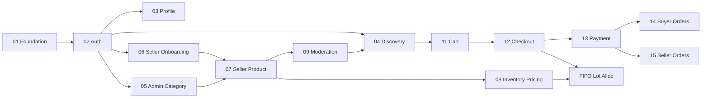

# AIDR — Plan Implement Module

Thứ tự implement theo **dependency** (nền tảng → catalog → mua bán → vận hành → AI).  
Cập nhật cột **status**: `Todo` · `In Progress` · `Done` · `Blocked`.

**Gợi ý sprint:** mỗi module P0 xong mới sang module phụ thuộc nặng (Order cần Product Approved + Auth).

---

## Implementation Order

| no | name | Description | usecase (module) | status |
|----|------|-------------|------------------|--------|
| 01 | Foundation / Infrastructure | Solution .NET + React scaffold; Docker; EF Core map `database.sql`; Redis client; NGINX; Keycloak realm; config env; health checks; Shared DTOs. **Chưa có UI nghiệp vụ** nhưng unblock mọi module sau. | — (tech enabler) | Done |
| 02 | Auth | Đăng ký, login email, Google OIDC, logout, quên MK, JWT/role guard FE+BE. | UC-01, UC-02, UC-03, UC-04, UC-05 | Done |
| 03 | Profile | Xem/sửa profile, avatar Cloudinary, địa chỉ, đổi MK. | UC-06, UC-07, UC-08 | Done |
| 04 | Discovery (Catalog Read) | API + FE public: list/detail SP, category tree, search, filter/sort; Redis cache list. Chỉ hiện SP `Approved`. | UC-09, UC-10, UC-11, UC-26, UC-27 | Done |
| 05 | Admin — Category | CRUD/activate category — **làm trước** để Seller gắn CategoryId khi tạo SP. | UC-22, UC-23, UC-24, UC-25 | Done |
| 06 | Admin — Seller Onboarding | Duyệt đăng ký seller → tạo Shop + Wallet + role. Cần trước khi Seller Center thật. | UC-75, UC-76 | Done |
| 07 | SellerCenter — Product | CRUD SP seller, upload ảnh, my products; SP vào `Pending`. | UC-12, UC-13, UC-14, UC-15, UC-16 | Done |
| 08 | SellerCenter — Inventory & Pricing | Nhập lô (UnitCost), quản lý tồn, đổi giá bán + price history. | UC-17, UC-91, UC-92 | Done |
| 09 | Admin — Product Moderation | Queue duyệt/từ chối SP + history → SP lên kệ Discovery. **Khóa vertical slice bán hàng.** | UC-18, UC-19, UC-20, UC-21 | Done |
| 10 | Shop Public Page | Trang chi tiết seller cho buyer (trust). | UC-62b, UC-64 | Done |
| 11 | Order — Cart | Giỏ hàng add/view/remove. | UC-29, UC-30, UC-31 | Done |
| 12 | Order — Checkout | Tạo đơn (split shop), snapshot địa chỉ/giá, reserve stock FIFO lot allocation. | UC-34 | Done |
| 13 | Payment | payOS create link + webhook → Paid; gắn UC-35. | UC-35 | Done |
| 14 | Order — Buyer Lifecycle | List/detail đơn, hủy, xác nhận nhận hàng. | UC-39, UC-40, UC-41, UC-42 | Done |
| 15 | SellerCenter — Orders | Seller xem đơn & cập nhật status + tracking. | UC-46, UC-47 | Done |
| 16 | Voucher (Buyer apply) | Xem & apply voucher (cần có data voucher — seed hoặc làm song song Admin/Seller voucher). | UC-32, UC-33 | Done |
| 17 | Admin — System Voucher | CRUD/activate voucher toàn sàn. | UC-78, UC-79, UC-80, UC-81 | Done |
| 18 | SellerCenter — Shop Voucher | CRUD voucher của shop. | UC-87, UC-88, UC-89 | Todo |
| 19 | Engagement — Wishlist | Wishlist CRUD. | UC-36, UC-37, UC-38 | Todo |
| 20 | Engagement — Reviews & Ratings | Review SP + rate seller. | UC-59, UC-60, UC-61, UC-62a, UC-63 | Todo |
| 21 | Engagement — Follow | Follow / unfollow / list. | UC-65, UC-66, UC-67 | Todo |
| 22 | Return & Refund | Buyer request **Trả hàng+Hoàn tiền** (video Unboxing/Testing); Admin duyệt; **không Exchange**; refund buyer rồi debit seller wallet. | UC-43, UC-48, UC-49, UC-50, UC-52 | Todo |
| 23 | Notifications | REST inbox + SignalR push (order/payment/moderation). | UC-44, UC-45 | Todo |
| 24 | Chat | Thread list + gửi tin SignalR. | UC-57, UC-58 | Todo |
| 25 | SellerCenter — Finance & Insights | Wallet, dashboard, sales reports (dùng cost lot → margin). | UC-69, UC-70, UC-85 | Todo |
| 26 | Admin — Governance | Account list, lock/unlock, customer insights. | UC-71, UC-72, UC-73, UC-74 | Todo |
| 27 | AI — Recommendation & Similar | Recommend + similar (rule/hybrid trước, LLM sau nếu cần). | UC-53, UC-54 | Todo |
| 28 | AI — NL Filter & Compare | Natural language → filter; so sánh SP. | UC-90, UC-28 | Todo |
| 29 | AI — Shopping Assistant | Chatbot mua sắm Ollama + lưu AiConversations. | UC-56 | Todo |
| 30 | Hardening & Observability | Grafana dashboards, rate-limit AI/login, E2E smoke, perf cache, docs API. | — (NFR) | Todo |

---

## Lộ trình gợi ý theo mốc

| Milestone | Modules | Mục tiêu demo |
|-----------|---------|----------------|
| **M1 — Skeleton** | 01 → 03 | Login/Register/Profile chạy |
| **M2 — Catalog live** | 04 → 09 | Seller tạo SP → Admin duyệt → Guest xem/search |
| **M3 — Buy path** | 10 → 15 | Cart → Order → payOS → Seller đổi status → Buyer confirm |
| **M4 — Growth ops** | 16 → 22 | Voucher, wishlist, review, return |
| **M5 — Realtime & money** | 23 → 26 | Notify, chat, wallet, admin lock |
| **M6 — AI differentiator** | 27 → 29 | Recommend, NL filter, compare, chatbot |
| **M7 — Release** | 30 | Ổn định, monitor, checklist Report |

---

## Dependency (tóm tắt)

---

## Quy tắc quản lý status

1. Chỉ để **In Progress** tối đa 1–2 module/người cùng lúc.
2. Module **Blocked** phải ghi chú phụ thuộc (VD: `13 Payment` blocked bởi tài khoản payOS sandbox).
3. Khi module `Done`, đánh `Done` các UC tương ứng trong `usecase.md`.
4. Không nhảy sang AI (27–29) nếu M3 (buy path) chưa demo được.

---

## File liên quan

| File | Vai trò |
|------|---------|
| `usecase.md` | Chi tiết từng UC + priority/status |
| `bussiness-system.md` | Nghiệp vụ & BR |
| `architecture-aidr-be.md` / `architecture-aidr-fe.md` | Cấu trúc code |
| `database.sql` | Schema + seed |
