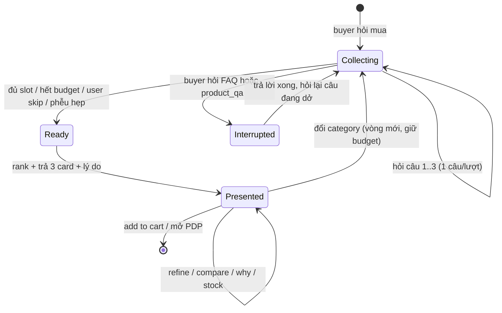
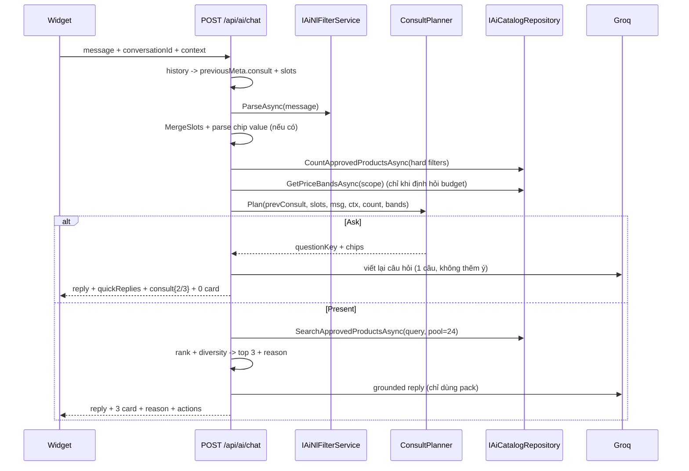

# AIDR - Solution: Guided Consultation (AI hỏi trước, tư vấn sau)

**Status:** Implemented (Phase A–D), đã test end-to-end **23/23 PASS** - §19 các điểm lệch thiết kế, §20 các lỗi sửa sau khi chạy thật
**Module:** 29 - AI Shopping Assistant · **Use case:** UC-56 (enhance)
**Tiền đề:** `docs/solution-ai-shopping-assistant.md` Phase 1–2 đã ship (intent router, slot memory, NL filter + Discovery search, grounded pack, MetaJson).
**Phạm vi doc này:** thêm tầng **hội thoại dẫn dắt** - khi buyer hỏi mua một sản phẩm, AI hỏi tối đa **3 câu** để chốt nhu cầu rồi mới gợi ý, và xử lý các lượt hỏi tiếp theo.

---

## 1. Nguyên tắc thiết kế

> "3 câu hỏi" là **ngân sách tối đa**, không phải kịch bản cứng.

1. **Không bao giờ hỏi lại thứ user đã nói.** `"Laptop gaming dưới 25 triệu"` → 2/3 slot đã đầy, chỉ còn hỏi 1 câu.
2. **Mỗi lượt hỏi đúng 1 câu**, kèm chip trả lời nhanh (1 chạm, không phải gõ).
3. **Hỏi theo thứ tự information gain** - cái nào cắt phễu mạnh nhất hỏi trước.
4. **Luôn có đường thoát**: chip `Not sure` bỏ 1 slot, nút `Skip questions` bỏ cả vòng → nhảy thẳng sang gợi ý.
5. **Hỏi là để lọc được thật.** Chỉ hỏi thứ map được vào filter DB hoặc vào công thức rank. Không hỏi cho có vẻ thông minh.
6. **Câu hỏi do rule sinh ra, LLM chỉ diễn đạt lại.** → chạy được cả khi `Groq:UseMock=true` hoặc Groq chết.
7. **Ngắt mạch được**: giữa lúc hỏi, user hỏi chuyện khác (đổi trả, bảo hành) → trả lời, rồi hỏi lại câu đang dở, **không tính vào ngân sách**.

### 1.1 Không làm (v1)

- Không thêm bảng SQL (`ProductAttributes` / facet) - dùng `MetaJson` + `SpecsJson` sẵn có.
- Không agent loop / function-calling; vẫn 1 completion Groq mỗi lượt.
- Không hỏi quá 3 câu trong 1 vòng tư vấn.
- Không hỏi khi user đang ở PDP và hỏi về đúng máy đó.

---

## 2. Khoảng trống của flow hiện tại

`ClassifyIntent` hiện có `IntentClarify` nhưng:

| Vấn đề hôm nay | Hệ quả |
|---|---|
| `clarify` chỉ là 1 nhánh dead-end, không có state | Hỏi 1 câu rồi quên mất mình đang hỏi gì |
| `if (intent == Clarify && HasUsefulSlots(slots)) intent = Recommend` | Chỉ cần chạm 1 slot là bắn 5 card, bỏ qua tư vấn |
| Không có khái niệm "vòng tư vấn" | Không biết đã hỏi mấy câu, không biết khi nào dừng |
| Câu hỏi do LLM tự nghĩ | `UseMock` → mất hẳn khả năng hỏi |
| Không có quick reply | User phải gõ, tỷ lệ bỏ ngang cao |
| Slot chỉ có brand/category/price/rating/sort | Không nhớ **mục đích dùng** và **ưu tiên** - 2 thứ quyết định chất lượng tư vấn |

---

## 3. Vòng tư vấn (Consult Round)

Một **round** = 1 lần buyer muốn mua 1 nhóm hàng. Round có:

```
consult = {
  roundId, stage, askedCount, asked[], pendingQuestion, answers{}, skipped
}
```

`stage`: `collecting` → `ready` → `presented`

- **collecting** - còn thiếu slot, còn ngân sách câu hỏi → hỏi.
- **ready** - đủ điều kiện search → chạy tool, rank, trả 3 card.
- **presented** - đã gợi ý; lượt sau đi vào nhánh follow-up (refine / compare / product_qa / …).

Round **reset** khi: đổi category (đang tư vấn laptop, hỏi sang tai nghe), bấm New chat, hoặc user nói "tìm cái khác".
Khi reset: **giữ lại `budget`** (ngân sách là thuộc tính của người, không của món hàng), xoá `useCase` + `priority`.

---

## 4. Bộ 4 slot tư vấn - hỏi tối đa 3

| # | Slot | Bắt buộc? | Map vào | Bỏ qua khi |
|---|---|---|---|---|
| 1 | `category` | Hard | `ProductQueryRequest.CategoryId` | NL parse ra, hoặc PDP context, hoặc suy được từ câu hỏi |
| 2 | `budget` | Hard | `MinPrice` / `MaxPrice` | NL parse ra giá |
| 3 | `useCase` (mục đích dùng) | Soft | sub-category (nếu có) + trọng số rank - **không** đụng `Q`, xem §8.1 | User đã mô tả mục đích |
| 4 | `priority` (ưu tiên nhất) | Soft | `Sort` / `MinRating` + trọng số rank | User đã nói ("pin trâu", "rẻ nhất") |

Ngân sách 3 câu ⇒ luôn có ít nhất 1 slot **không được hỏi**. Slot không hỏi được lấy **default an toàn**:

- `useCase` trống → không thêm keyword, rank theo chất lượng.
- `priority` trống → `Sort = popular`, ưu tiên rating Bayesian.
- `budget` trống (hiếm - nó là ưu tiên hỏi số 2) → không lọc giá, rank ưu tiên giá gần trung vị.

### 4.1 Thứ tự ưu tiên hỏi

```
category (nếu unknown)  >  useCase  >  budget  >  priority
```

- `category` trước tiên: hard filter mạnh nhất, sai là ra kết quả rác.
- `useCase` **trước** `budget`: trả lời "Gaming" thu hẹp xuống `laptop-gaming`, nên dải giá dùng để sinh chip ngân sách (§5.3) là giá thật của đúng kệ hàng đó chứ không phải của cả danh mục. Hỏi ngược lại sẽ đưa ra chip ngân sách sai lệch.
- `priority` cuối: chỉ đổi thứ tự xếp hạng, thiếu cũng không chết.

---

## 5. Ngân hàng câu hỏi (deterministic, theo category)

Bảng tra cứu tĩnh trong `AiConsultQuestionBank`. LLM **không sinh câu hỏi mới**, chỉ được viết lại cho tự nhiên (§12).

> Nhãn chip trong doc này viết tiếng Việt cho dễ đọc; **bản ship dùng tiếng Anh** để khớp UI widget hiện tại (xem §19 mục 6). Cấu trúc và ngữ nghĩa giữ nguyên.

### 5.1 Câu hỏi `category` (khi chưa biết)

> "Bạn đang tìm nhóm sản phẩm nào?"
> Chips = top-level `Categories` đang active (Phones, Laptops, Tablets, Audio, Wearables, TVs & Monitors, Smart Home, Gaming Gear, Accessories) - lấy từ `IAiCatalogRepository.GetActiveCategoriesAsync`, không hardcode.

### 5.2 Câu hỏi `useCase` + `priority` theo category

| Category | `useCase` chips | `priority` chips |
|---|---|---|
| Phones | Chụp ảnh · Chơi game · Dùng cơ bản · Pin lâu | Camera · Pin · Hiệu năng · Giá tốt nhất |
| Laptops | Văn phòng & học · Gaming · Đồ hoạ/video · Mỏng nhẹ đi lại | Hiệu năng · Màn hình · Pin & cân nặng · Giá tốt nhất |
| Tablets | Học & ghi chú · Vẽ/thiết kế · Giải trí · Cho trẻ nhỏ | Màn hình · Hỗ trợ bút · Pin · Giá tốt nhất |
| Audio | Đi lại/chống ồn · Thể thao · Nghe nhạc kỹ · Họp online | Chất âm · Chống ồn · Pin · Giá tốt nhất |
| Wearables | Thể thao · Theo dõi sức khoẻ · Thông báo/tiện ích | Pin · Cảm biến · Giá tốt nhất |
| TVs & Monitors | Xem phim · Chơi game · Làm việc | Tần số quét · Kích thước · Giá tốt nhất |
| Gaming Gear | FPS/tốc độ · MOBA/chiến thuật · Stream | Độ trễ · Độ bền · Giá tốt nhất |
| Smart Home | An ninh · Chiếu sáng · Tự động hoá | Tương thích · Giá tốt nhất |
| Accessories | *(bỏ qua `useCase`)* - hỏi "Dùng cho máy nào?" | Chính hãng · Giá tốt nhất |

Mỗi chip có **`value` nội bộ** kèm keyword & trọng số, ví dụ:

```jsonc
{
  "key": "useCase",
  "label": "Gaming",
  "value": "gaming",
  "childCategorySlug": "laptop-gaming",   // dùng nếu tồn tại
  "keywords": ["gaming", "RTX", "GeForce", "144Hz", "165Hz"],
  "boostSpecKeys": ["gpu", "refreshRate", "cpu"]
}
```

### 5.3 Câu hỏi `budget` - chip sinh từ dữ liệu thật

Không hardcode "dưới 10 triệu". Gọi repo mới:

```csharp
Task<AiPriceBands> GetPriceBandsAsync(ProductQueryRequest scope, CancellationToken ct);
// => { Count, Min, P33, P66, Max }  (EffectivePrice của Approved products trong scope)
```

Sinh 4 chip, làm tròn "đẹp" (dưới 10 triệu → bội 500k; trên → bội 1 triệu):

> "Ngân sách của bạn khoảng bao nhiêu?"
> `Dưới 12 triệu` · `12–22 triệu` · `22–35 triệu` · `Trên 35 triệu` · `Chưa rõ`

Ưu điểm: chip luôn khớp hàng thật đang bán → không bao giờ chọn xong ra 0 kết quả.
Nếu `Count < 8` → **bỏ hẳn câu budget** (danh mục quá ít hàng, lọc giá vô nghĩa) và tiết kiệm 1 câu cho `useCase`.

---

## 6. Question Planner - thuật toán chọn câu hỏi

Class thuần static, không I/O ngoài 2 lời gọi repo đã có → test unit dễ.

```csharp
ConsultDecision Plan(
    ConsultState? prev,     // từ MetaJson lượt trước
    SlotState slots,        // sau MergeSlots
    string message,
    AiChatContextDto? context,
    int candidateCount,     // COUNT theo hard filter hiện tại
    AiPriceBands bands);
// => Ask(questionKey, chips) | Present | Relax
```

Pseudocode:

```
plan(prev, slots, msg, ctx, count, bands):
  consult = prev ?? newRound()

  # R0 - không tư vấn khi đang soi 1 máy cụ thể
  if ctx.productId != null and intent in {product_qa, compare}: return Present

  # R1 - user xin thoát
  if matchesSkip(msg):                       # "xem luôn", "sao cũng được", "bất kỳ", "skip"
      consult.skipped = true; return Present

  # R2 - đổi chủ đề => vòng mới, giữ budget
  if categoryChanged(prev, slots): consult = newRound(keepBudget: true)

  # R3 - hết ngân sách
  if consult.askedCount >= MaxConsultQuestions: return Present

  # R4 - phễu đã đủ hẹp => dừng hỏi sớm
  if slots.categoryId != null and hasBudget(slots) and count <= EarlyPresentThreshold:
      return Present

  # R5 - không còn gì để lọc
  if count == 0: return Relax                              # xem §8.3
  if count <= MinCandidatesToStopAsking: return Present     # 1..3 kết quả: hỏi thêm là vô nghĩa

  # R6 - chọn slot còn thiếu theo thứ tự ưu tiên
  for key in [category, budget, useCase, priority]:
      if isFilled(key, slots, consult): continue
      if key in consult.asked: continue      # đã hỏi mà user né => không hỏi lại
      if key == budget and bands.Count < BudgetQuestionMinPool: continue
      if key == useCase and bank.useCase(slots.categoryId) == null: continue
      return Ask(key, bank.chips(key, slots.categoryId, bands))

  return Present
```

Hằng số đề xuất (`AiConstants`):

```csharp
public const int MaxConsultQuestions = 3;
public const int EarlyPresentThreshold = 12;      // đủ hẹp thì thôi hỏi
public const int MinCandidatesToStopAsking = 3;
public const int BudgetQuestionMinPool = 8;
public const int ConsultCandidatePool = 24;       // = clamp hiện tại của SearchApprovedProductsAsync
public const int ConsultPresentCount = 3;         // gợi ý 3 máy, không phải 5
```

> **Tại sao 3 card thay vì 5?** Tư vấn xong mà đổ 5 lựa chọn là đẩy quyết định ngược lại cho user. 3 = "phù hợp nhất / tiết kiệm hơn / nâng cấp" (§8.2). `MaxSuggestedProducts = 5` giữ nguyên cho intent `recommend` thường.

### 6.1 Trả lời nhiều slot trong 1 câu

`askedCount` đếm **số câu đã hỏi**, không phải số slot đã đầy. User trả lời `"Gaming, 25 triệu"` cho 1 câu hỏi → NL filter + chip parser lấp 2 slot, chỉ tốn 1 câu. Đây là lý do phải chạy `MergeSlots` **trước** planner ở mọi lượt.

---

## 7. State machine & luồng 1 lượt





---

## 8. Từ câu trả lời → filter & xếp hạng

### 8.1 Bảng mapping

| Slot / câu trả lời | Tác động |
|---|---|
| `category` = Laptops | `CategoryId` (repo đã include cả child category) |
| `budget` = "12–22 triệu" | `MinPrice=12tr`, `MaxPrice=22tr` (hard) |
| `budget` = "Trên 35 triệu" | `MinPrice=35tr` |
| `useCase` = Gaming | Có child category `laptop-gaming` → dùng `CategoryId` con |
| `useCase` = Mỏng nhẹ | Không có category con → **chỉ boost rank** theo `keywords`, không đụng vào `Q` |
| `priority` = Giá tốt nhất | `Sort = price_asc`, `w_price += 0.15` |
| `priority` = Camera / Pin / Hiệu năng | Không đổi filter; `w_spec` áp lên `boostSpecKeys` |
| `priority` = Đáng tin cậy | `MinRating = 4`, `Sort = rating` |

> **Giới hạn thật của hệ thống - nói thẳng:** DB không có bảng thuộc tính chuẩn hoá; `SpecsJson` là free-form JSON và `Discovery` chỉ lọc được `q / categoryId / brand / price / rating / sort`. Vì vậy `useCase` và `priority` **chỉ là tín hiệu xếp hạng**, không phải filter cứng. Muốn lọc cứng kiểu "RAM ≥ 16GB" thì cần bảng `ProductAttributes` - đẩy sang Phase E. Cần chấp nhận: 2 câu hỏi sau cải thiện *thứ tự*, không đảm bảo *loại trừ*.
>
> **Keyword của `useCase` cố ý KHÔNG đưa vào `Q`.** `Discovery.Q` là một chuỗi `Contains` duy nhất, nhét `"RTX"` hay `"office"` vào sẽ loại nhầm hàng loạt sản phẩm hợp lệ. Narrow bằng child category (hard, chính xác) hoặc bằng rank (soft) - không narrow bằng keyword đoán.

### 8.2 Công thức rank

Chạy trên pool ≤ 24 record lấy từ `SearchApprovedProductsAsync`, tất cả field lấy từ `AiCompareProductRecord`:

```
score =
    0.25 * priceFit
  + 0.25 * useCaseMatch
  + 0.15 * priorityMatch
  + 0.20 * quality
  + 0.10 * popularity
  + 0.05 * warrantyBonus
```

| Thành phần | Công thức |
|---|---|
| `priceFit` | Đỉnh ở **85% trần ngân sách** (mua được nhiều nhất trong túi tiền): `1 - min(1, |p - 0.85*max| / (0.85*max))`. Không có budget → đỉnh ở trung vị pool; nhưng nếu `priority = Best price` và không có trần → đỉnh ở **giá thấp nhất pool** (nếu vẫn kéo về trung vị là đi ngược ý người dùng) |
| `useCaseMatch` | Tỉ lệ keyword của chip trúng `Name` / `ShortDescription` / `TagsJson` / `SpecsJson` |
| `priorityMatch` | Như trên nhưng theo `boostSpecKeys`; `priority = Giá tốt nhất` → dùng nghịch đảo giá chuẩn hoá |
| `quality` | Bayesian: `(AvgRating*ReviewCount + 4.0*m) / (ReviewCount + m) / 5`, `m = 5` → chặn hàng 1 review 5 sao |
| `popularity` | `log(1+SoldCount) / log(1+maxSoldInPool)` |
| `warrantyBonus` | `min(1, WarrantyMonths / 24)` |

**Gate & đa dạng hoá:**

- `StockQuantity - ReservedQuantity <= 0` → `score *= 0.2`, không vào top 3 nếu còn lựa chọn khác.
- Top 3 tối đa **2 sản phẩm cùng brand** và **2 cùng shop** (tránh 3 con iPhone y hệt).
- Nếu sau rank còn ≥ 5 ứng viên: cố tình chọn **1 rẻ hơn ~20% so với top-1** làm "tiết kiệm hơn" và **1 đắt hơn** làm "nâng cấp" → 3 card thành một **bộ lựa chọn có cấu trúc**, không phải 3 kết quả na ná nhau.

### 8.3 Khi ra 0 kết quả (`Relax`)

Nới **theo đúng thứ tự này**, mỗi lần 1 bậc, và **nói ra đã nới gì**:

1. Bỏ `MinRating`.
2. Nới `MaxPrice` +20% → *"Trong tầm 20 triệu chưa có máy nào hợp; ở mức 24 triệu thì có 3 lựa chọn…"*
3. Bỏ keyword `useCase`, giữ category + giá.
4. Bỏ `Brand`.
5. Vẫn 0 → nói thật là chưa có hàng, đề xuất category gần nhất + CTA mở catalog. **Không bịa sản phẩm.**

Lần nới nào cũng ghi vào reply và vào `consult.relaxed[]`. Tuyệt đối không im lặng trả kết quả lệch điều kiện.

---

## 9. Sau khi đã gợi ý - nhánh follow-up

`stage = presented`. Không hỏi lại bộ 3 câu nữa (trừ khi đổi category).

| Buyer nói | Intent | Xử lý |
|---|---|---|
| "rẻ hơn nữa" / "cheaper" | `refine` | `MaxPrice = 0.85 * hiện tại`, `Sort = price_asc`, giữ nguyên `useCase`/`priority` |
| "của Asus thôi" | `refine` | Ghi đè `Brand`, giữ phần còn lại |
| "sao lại chọn con này?" | `explain` *(mới)* | Bung `reason` đầy đủ từ DB: giá, rating, số đã bán, spec khớp `useCase`, bảo hành. Không để LLM tự chế |
| "so sánh con 1 và 2" | `compare` | `IAiCompareService` với id từ `MetaJson.productIds` |
| "còn hàng không?" | `product_qa` | `StockQuantity - ReservedQuantity` |
| "bảo hành bao lâu?" | `product_qa` | `WarrantyMonths` của đúng máy được nhắc |
| "đổi trả thế nào?" | `faq` | Policy grounded (§7.5 doc cũ) |
| "còn lựa chọn nào khác?" | `refine` | Trả 3 card **kế tiếp** trong pool đã rank, loại id đã show (lưu `consult.shownIds`) |
| "thôi tìm tai nghe đi" | `consult` | Round mới, giữ `budget`, hỏi lại từ `useCase` |

### 9.1 Ngắt mạch giữa lúc hỏi (quan trọng)

Đang hỏi câu 2/3, user hỏi *"Đổi trả trong bao lâu?"*:

1. Trả lời FAQ grounded.
2. **Cuối cùng của cùng một reply**, nối lại câu đang dở: *"…Quay lại nhé - bạn định dùng máy chủ yếu để làm gì?"* + giữ nguyên chips.
3. `askedCount` **không tăng** (lượt này không phải câu tư vấn mới).
4. `pendingQuestion` giữ nguyên trong `MetaJson`.

---

## 10. Guardrails chống phiền

| # | Luật | Cưỡng chế ở đâu |
|---|---|---|
| G1 | Tối đa 1 câu hỏi / lượt | Planner trả tối đa 1 `Ask` |
| G2 | Tối đa 3 câu / round | `askedCount >= MaxConsultQuestions → Present` |
| G3 | Không hỏi lại slot đã có giá trị hoặc đã từng hỏi | `consult.asked[]` |
| G4 | Luôn có đường thoát | Mỗi câu có chip `Not sure` (bỏ **1 slot**) + nút riêng "Skip questions & show options" gửi `skip=all` (kết thúc **cả vòng**) |
| G5 | Đang ở PDP hỏi về máy đó → 0 câu hỏi | R0 trong planner |
| G6 | Phễu ≤ 12 kết quả → thôi hỏi | R4 |
| G7 | LLM không được thêm câu hỏi nào ngoài câu planner đưa | Prompt cấm + đếm dấu `?` trong reply, thừa thì cắt |
| G8 | Lượt `Ask` trả **0 product card** | Ép `suggested = []` như nhánh `clarify` hiện tại |

G7 đáng lưu ý: mô hình rất hay tự thêm *"Bạn có thích màu nào không?"*. Validate reply của LLM ở lượt `Ask`: nhiều hơn 1 dấu `?` → giữ câu hỏi đầu, bỏ phần sau.

---

## 11. Hợp đồng dữ liệu

### 11.1 `MetaJson` - thêm block `consult` (không đổi schema SQL)

```jsonc
{
  "source": "groq",
  "intent": "clarify",
  "slots": { "categoryId": 12, "categoryName": "Laptops", "maxPrice": 25000000, "sort": null },
  "consult": {
    "roundId": 1,
    "stage": "collecting",
    "askedCount": 2,
    "asked": ["category", "budget"],
    "pendingQuestion": "useCase",
    "answers": { "category": "Laptops", "budget": "12-22tr", "useCase": null, "priority": null },
    "relaxed": [],
    "shownIds": []
  },
  "productIds": [],
  "reasons": {},
  "actions": []
}
```

### 11.2 DTO mới (đều optional - FE cũ bỏ qua field lạ)

```csharp
public sealed class AiQuickReplyDto
{
    public string Key   { get; init; } = null!;   // useCase | budget | priority | category | skip
    public string Label { get; init; } = null!;   // hiển thị
    public string Value { get; init; } = null!;   // gửi lại BE, parse chính xác không qua NLU
}

public sealed class AiConsultStateDto
{
    public string Stage { get; init; } = null!;          // collecting | ready | presented
    public int AskedCount { get; init; }
    public int MaxQuestions { get; init; }
    public string? PendingQuestion { get; init; }
}
```

`AiChatResultDto` thêm:

```csharp
public IReadOnlyList<AiQuickReplyDto> QuickReplies { get; init; } = Array.Empty<AiQuickReplyDto>();
public AiConsultStateDto? Consult { get; init; }
```

`AiChatRequest` thêm:

```csharp
/// <summary>Set khi buyer bấm chip trả lời nhanh - bỏ qua NLU, gán slot trực tiếp.</summary>
public string? QuickReplyValue { get; set; }
```

> Chip gửi kèm `quickReplyValue` giúp **không phụ thuộc NLU** cho câu trả lời quan trọng nhất. Chip "Gaming" phải luôn ra `useCase=gaming`, không được để LLM đoán.

### 11.3 Repo mới

```csharp
Task<int> CountApprovedProductsAsync(ProductQueryRequest query, CancellationToken ct = default);
Task<AiPriceBands> GetPriceBandsAsync(ProductQueryRequest scope, CancellationToken ct = default);
```

Dùng lại `BuildApprovedQuery()` - cùng predicate Approved / category active / shop Active.

### 11.4 Intent

Giữ `IntentClarify` cho lượt hỏi (FE đã handle), thêm:

```csharp
public const string IntentExplain = "explain";   // "sao chọn con này?"
```

---

## 12. Prompt LLM

Hai chế độ, không trộn lẫn.

**Chế độ A - Ask turn.** Input: `questionKey`, câu hỏi gốc từ bank, chips, slot đã biết.

```
You are a shopping consultant. Rewrite the given question naturally in ONE sentence.
Rules: ask exactly ONE question. Do NOT add new questions.
Do NOT mention products, prices, or ids. Do NOT invent options beyond the provided chips.
Acknowledge what the buyer already told you in at most one short clause.
Output JSON: { "reply": "..." }
```

**Chế độ B - Present turn.** Giữ contract cũ (`reply` / `productIds` / `reasons` / `actions`), bổ sung:

```
The buyer told you: category=Laptops, budget=12-22M, useCase=gaming.
Open with one sentence tying the picks to what they said.
Cite ONLY products from the pack. Each reason must reference a fact in the pack
(price, rating, sold count, spec, warranty). Max 3 products. No new questions.
```

Parse fail / Groq chết → dùng thẳng câu hỏi gốc từ bank (chế độ A) hoặc reply heuristic trên cùng pack (chế độ B). **Consultation vẫn hoạt động 100% khi không có LLM** - đây là lý do question bank phải là rule, không phải prompt.

---

## 13. Frontend

- **Chip trả lời nhanh** render trong bubble assistant khi `quickReplies.length > 0`; bấm → `send(message: label, quickReplyValue: value)`. Reuse class `aidr-assistant-*` trong `styles/chat.css`.
- **Chỉ báo tiến độ**: `Câu 2/3` nhỏ, mờ, cạnh chip. Cho user thấy sắp xong → giảm bỏ ngang.
- **Nút "Bỏ qua, xem gợi ý luôn"** luôn hiện ở lượt hỏi.
- **Slot chips hiện có** (`formatSlotChips`) mở rộng hiển thị `useCase` / `priority`; bấm ✕ để xoá 1 slot → gửi lại lượt refine.
- **Card ở lượt present**: 3 card, mỗi card 1 dòng `reason`, và badge cấu trúc `Phù hợp nhất` / `Tiết kiệm hơn` / `Nâng cấp`.
- **Đang gõ khi có chip**: gõ tay vẫn hoạt động bình thường - chip là lối tắt, không phải bắt buộc.
- Quick prompt mặc định đổi thành lời mời tư vấn: *"Tư vấn giúp tôi chọn laptop"*, *"Tôi cần điện thoại chụp ảnh đẹp"*.

---

## 14. Kịch bản mẫu

### 14.1 Từ câu hỏi mơ hồ - dùng đủ 3 câu

```
U: tôi muốn mua laptop
A: Mình tư vấn cho bạn nhé. Bạn sẽ dùng máy chủ yếu vào việc gì?      [Câu 1/3]
   [Văn phòng & học] [Gaming] [Đồ hoạ/video] [Mỏng nhẹ đi lại] [Sao cũng được]
U: [Gaming]
A: Rõ rồi. Ngân sách của bạn khoảng bao nhiêu?                        [Câu 2/3]
   [Dưới 18 triệu] [18–28 triệu] [28–40 triệu] [Trên 40 triệu] [Chưa rõ]
U: [18–28 triệu]
A: Trong tầm đó, bạn ưu tiên điều gì nhất?                            [Câu 3/3]
   [Hiệu năng] [Màn hình] [Pin & cân nặng] [Giá tốt nhất]
U: [Hiệu năng]
A: Laptop gaming 18–28 triệu, ưu tiên hiệu năng - 3 lựa chọn:
   • ASUS TUF F15 - 24.9tr · RTX 4060, 144Hz · 4.6★ (128 đánh giá)    [Phù hợp nhất]
   • Acer Nitro V  - 19.5tr · RTX 4050 · rẻ hơn 5.4tr, vẫn 144Hz      [Tiết kiệm hơn]
   • Lenovo LOQ    - 27.8tr · RTX 4060 + 16GB RAM · BH 24 tháng       [Nâng cấp]
   [Xem tất cả máy phù hợp] [So sánh 3 máy]
```

### 14.2 Câu hỏi đã đủ thông tin - **không hỏi câu nào**

```
U: tư vấn điện thoại Samsung dưới 15 triệu chụp ảnh đẹp
   → NL: brand=Samsung, category=Phones, maxPrice=15tr; useCase=chụp ảnh (keyword)
   → count = 9 ≤ EarlyPresentThreshold ⇒ Present ngay
A: Samsung dưới 15 triệu, ưu tiên camera - 3 lựa chọn: …
```

### 14.3 Trả lời gộp - 3 câu rút còn 1

```
U: cần tai nghe
A: Bạn dùng tai nghe trong hoàn cảnh nào?                             [Câu 1/3]
   [Đi lại/chống ồn] [Thể thao] [Nghe nhạc kỹ] [Họp online] [Sao cũng được]
U: đi làm, tầm 3 triệu, quan trọng nhất là chống ồn
   → 1 lượt lấp cả useCase + budget + priority ⇒ Present
A: Tai nghe chống ồn quanh 3 triệu - 3 lựa chọn: …
```

### 14.4 Ngắt mạch rồi quay lại

```
U: muốn mua tablet cho con học
A: Ngân sách khoảng bao nhiêu?                                        [Câu 2/3]
U: khoan, sản phẩm này đổi trả được không?
A: AIDR hỗ trợ hoàn tiền (không đổi hàng), cần video Unboxing + Testing …
   Quay lại nhé - ngân sách bạn dự tính khoảng bao nhiêu?             [Câu 2/3]
   (askedCount vẫn = 2)
```

### 14.5 Không có hàng - nới và nói ra

```
U: laptop gaming dưới 10 triệu
A: Dưới 10 triệu hiện chưa có máy gaming nào đang bán.
   Nới lên 13 triệu thì có 2 lựa chọn - hoặc bạn xem laptop văn phòng dưới 10 triệu?
   [Xem 2 máy ~13 triệu] [Laptop văn phòng dưới 10 triệu]
```

---

## 15. Edge cases

| Tình huống | Xử lý |
|---|---|
| User trả lời lạc đề câu hỏi | NL không lấp được slot → **không hỏi lại**, đánh dấu `asked`, sang câu tiếp (G3) |
| User trả lời "không biết" | Coi như `skip` slot đó, sang slot tiếp, không tốn thêm câu |
| Chip cũ ở tin nhắn cũ bị bấm lại | `quickReplyValue` vẫn parse được; planner tự bỏ nếu slot đã đầy |
| Mở lại hội thoại cũ (history) | Hydrate `consult` từ `MetaJson` của assistant message cuối; đang `collecting` thì hiện lại chips |
| Đổi category giữa chừng | Round mới, giữ `budget`, `askedCount = 0` |
| User gõ tiếng Việt | NL filter đã hỗ trợ VI+EN; ngôn ngữ reply - xem §17 mục mở #1 |
| Prompt injection trong tin nhắn | Không đổi: chỉ search Approved, chỉ cite id trong pack |
| Guest (chưa login) | Ngoài UC-56, giữ nguyên hành vi hiện tại |
| Rate limit AI | Giữ nguyên; lượt `Ask` không gọi tool nặng → rẻ hơn lượt present |

---

## 16. Acceptance criteria

1. `"tôi muốn mua laptop"` → hỏi **đúng 1 câu** kèm chips, **0 product card**.
2. Trả lời đủ 3 câu → gợi ý **3 sản phẩm**, mỗi cái có `reason` truy được về field DB.
3. `"laptop gaming 20 triệu"` ngay câu đầu → **không hỏi câu nào**, present ngay.
4. Không câu hỏi nào lặp lại trong 1 round; `askedCount` không bao giờ > 3.
5. Trả lời gộp nhiều slot trong 1 lượt → giảm số câu còn lại tương ứng.
6. Bấm chip "Sao cũng được" → present ngay bằng slot hiện có.
7. Hỏi FAQ giữa chừng → trả lời + hỏi lại câu đang dở, `askedCount` không tăng.
8. `Groq:UseMock=true` → vẫn hỏi đủ 3 câu (bank rule) và vẫn present đúng filter.
9. 0 kết quả → nới theo thứ tự §8.3 và **nêu rõ đã nới gì**, không im lặng trả hàng lệch.
10. Top 3 không quá 2 sản phẩm cùng brand; hàng hết không nằm top 3 khi còn lựa chọn.
11. Chip budget luôn khớp dải giá thật (chọn xong không bao giờ ra 0 kết quả).
12. Đang ở PDP hỏi về máy đó → 0 câu hỏi tư vấn.
13. Mở lại hội thoại cũ đang dở → chips và tiến độ `Câu n/3` hiện lại đúng.
14. Không bịa product id / giá / spec / tồn kho.

---

## 17. Kế hoạch triển khai

### Phase A - Lõi consultation (BE)
- `AiConsultQuestionBank` (bank tĩnh + chip), `AiConsultPlanner` (§6), `ConsultState` trong `MetaJson`.
- `CountApprovedProductsAsync` + `GetPriceBandsAsync`.
- Nhánh `Ask` trong `ChatAsync`: 0 card, quick replies, prompt chế độ A + validate G7.
- Fallback heuristic dùng nguyên câu hỏi bank.

### Phase B - Present chất lượng
- Công thức rank §8.2 + diversity + bộ 3 "phù hợp / tiết kiệm / nâng cấp".
- `reason` grounded theo answers.
- `Relax` ladder §8.3.

### Phase C - FE
- Chip trả lời nhanh + `quickReplyValue`, tiến độ `Câu n/3`, nút bỏ qua.
- Badge card, slot chip mở rộng, hydrate consult từ history.

### Phase D - Follow-up
- Intent `explain`, `shownIds` cho "còn lựa chọn khác", reset round khi đổi category.

### Phase E - Sau (nếu cần)
- Bảng `ProductAttributes` để lọc cứng theo spec (RAM/chip/màn) - bỏ được giới hạn ở §8.1.
- Học ngân sách từ lịch sử đơn hàng của buyer → bỏ luôn câu hỏi budget.
- Streaming.

### File dự kiến chạm

**Backend**
- `AIDR.Modules/AI/Services/AiShoppingAssistantService.cs` - nhánh consult trong `ChatAsync`
- `AIDR.Modules/AI/Services/AiConsultPlanner.cs` *(mới)*, `AiConsultQuestionBank.cs` *(mới)*, `AiProductRanker.cs` *(mới)*
- `AIDR.Modules/AI/Abstractions/IAiCatalogRepository.cs` + `AIDR.Infrastructure/AI/AiCatalogRepository.cs` - count + price bands
- `AIDR.Shared/Dtos/AI/ChatDtos.cs` - `QuickReplies`, `Consult`, `QuickReplyValue`
- `AIDR.Shared/Constants/AiConstants.cs` - hằng số §6 + `IntentExplain`
- `scripts/seed-ai-assistant.sql` - thêm hội thoại demo 14.1 / 14.4

**Frontend**
- `types/ai.ts`, `store/aiSlice.ts`, `hooks/useAi.ts`, `services/aiApi.ts`
- `components/ai/ShoppingAssistantWidget.tsx`, `utils/aiChatUi.ts`, `styles/chat.css`

**Docs sau khi ship**
- `architecture-aidr-be.md` §6.7 - block `consult` trong MetaJson
- `architecture-aidr-fe.md` §10 - quick replies
- `usecase.md` - UC-56 giữ Done (enhance)

Không đổi `database.sql`.

---

## 18. Quyết định còn mở (tại thời điểm thiết kế)

| # | Câu hỏi | Đề xuất mặc định |
|---|---|---|
| 1 | Ngôn ngữ reply | Doc cũ chốt **English**. Nhưng tư vấn hỏi-đáp bằng tiếng Việt tự nhiên hơn với buyer VN → đề xuất **theo ngôn ngữ user gõ**, bank có sẵn 2 bản. Cần bạn chốt. |
| 2 | Số card ở lượt present | **3** (bộ có cấu trúc), giữ 5 cho intent `recommend` thường |
| 3 | Hỏi 1 câu/lượt hay 3 câu cùng lúc dạng form | **1 câu/lượt** - giống hội thoại, và cho phép trả lời gộp |
| 4 | `EarlyPresentThreshold` | 12 - chỉnh lại sau khi có số liệu thật |
| 5 | Có gợi ý sản phẩm ngay ở lượt hỏi không | **Không** - làm loãng câu hỏi, user bấm card là mất mạch tư vấn |

---

## 19. Đã implement - các điểm lệch so với thiết kế

| # | Thiết kế ban đầu | Đã ship | Lý do |
|---|---|---|---|
| 1 | Thứ tự hỏi `category > budget > useCase` | `category > useCase > budget` | useCase thu hẹp kệ hàng trước, chip ngân sách mới đúng giá thật (§4.1) |
| 2 | Keyword useCase cộng vào `Q` | Không đụng `Q`; chỉ child category + rank | `Discovery.Q` là 1 chuỗi `Contains`, nhét spec vào loại nhầm hàng loạt (§8.1) |
| 3 | 1 chip thoát | Chip `Not sure` (bỏ 1 slot) + nút `Skip questions` (bỏ cả vòng) | Hai ý định khác nhau, gộp lại thì label nói dối hành vi |
| 4 | Mọi lượt present đều 3 card | `recommend`/`refine` = 3, `browse` = 5 | Duyệt mở ("có gì hay") cần bề rộng, không phải bộ 3 có cấu trúc |
| 5 | - | `priority = Best price` + không trần giá → `priceFit` hướng về giá thấp nhất | Bug phát hiện khi test: `priceFit` kéo về trung vị, ngược ý người dùng |
| 6 | Ngôn ngữ reply | Giữ **English** (theo quyết định #2 doc cũ) | Toàn bộ UI widget đang English; bank tách sẵn text nên thêm bản VI là thêm 1 bảng |

### 19.1 File đã chạm

**Backend**
- `AIDR.Modules/AI/Services/AiConsultQuestionBank.cs` *(mới)* - bank câu hỏi + chip + wire format
- `AIDR.Modules/AI/Services/AiConsultPlanner.cs` *(mới)* - `SlotState`, `ConsultState`, thuật toán §6
- `AIDR.Modules/AI/Services/AiProductRanker.cs` *(mới)* - công thức §8.2 + diversity + badge
- `AIDR.Modules/AI/Services/AiShoppingAssistantService.cs` - nhánh consult, relax ladder, ngắt mạch
- `AIDR.Modules/AI/Abstractions/IAiCatalogRepository.cs` + `AIDR.Infrastructure/AI/AiCatalogRepository.cs` - `CountApprovedProductsAsync`, `GetPriceBandsAsync`, `AiCategoryLookup.ParentId`
- `AIDR.Shared/Dtos/AI/ChatDtos.cs` - `QuickReplyValue`, `QuickReplies`, `Consult`, `Badge`
- `AIDR.Shared/Constants/AiConstants.cs` - hằng số §6
- `scripts/seed-ai-assistant.sql` - hội thoại demo đang dở giữa vòng tư vấn

**Frontend**
- `types/ai.ts`, `store/aiSlice.ts`, `hooks/useAi.ts`
- `components/ai/ShoppingAssistantWidget.tsx` - chip, tiến độ `Question n/3`, nút skip, badge card
- `styles/chat.css`

Không đổi `database.sql`.

---

## 20. Lỗi phát hiện khi chạy thật & đã sửa

Chạy end-to-end ngày 2026-08-27 (`docs/test-ai-guided-consult.md` §J) lộ ra 10 lỗi mà build xanh và 41 unit test không bắt được.

| # | Triệu chứng quan sát được | Nguyên nhân | Sửa |
|---|---|---|---|
| 1 | "I want to buy a laptop" mở đầu bằng *"Nothing matched every requirement, so I relaxed the keyword filter"* | NL parser để lại `q="buy"`, search đầu tiên rỗng, thang nới báo cáo việc bỏ một ràng buộc **người dùng chưa từng nêu** | Bỏ `Q` là bước nới **im lặng** |
| 2 | Không bao giờ hỏi câu nào | `IsFilled(useCase)` coi mọi `slots.Q` là đã trả lời mục đích dùng | Chỉ tính khi `Q` thật sự chứa keyword mục đích dùng của ngành hàng (`MentionsUseCase`) |
| 3 | Bấm "Gaming" → trả về **điện thoại**, `askedCount` tụt về 0 | Narrow vào category con `Gaming Laptops` bị `HasSwitchedShelf` hiểu là đổi ngành hàng → reset vòng; thang nới sau đó **xoá sạch** category | So sánh **root category**; thang nới **nới lên cha**, không bao giờ xoá category |
| 4 | Bấm "Gaming" → nhảy sang ngành **Gaming Gear** | Nhãn chip bị đưa lại vào NL filter và LLM map "Gaming" → Gaming Gear | Có `quickReplyValue` thì **không gọi NL filter**, chỉ mang slot cũ sang |
| 5 | Hỏi 1 câu rồi dừng dù kệ hàng còn rộng | Planner đếm ứng viên **kèm `Q` rác** → tưởng kệ rỗng → R5 dừng hỏi | Đếm và tính dải giá bằng `ToShelfQuery` (bỏ `Q`) |
| 6 | "Samsung phone under 15 million" báo đã bỏ **brand Samsung** | Thang nới bỏ brand (người dùng nêu) **trước** khi nới category (máy suy) | Đảo thứ tự: nới ràng buộc **suy diễn** trước ràng buộc **người dùng nêu**; bỏ luôn sàn giá kế thừa |
| 7 | Đổi sang tai nghe vẫn giữ ngân sách 22–30 triệu → 0 kết quả | Ngân sách tuyệt đối không mang được sang ngành hàng khác | Chỉ giữ nếu kệ mới thực sự có hàng trong khoảng đó, không thì quên và hỏi lại |
| 8 | Catalog rỗng nhưng AI đưa lời khuyên cấu hình ("nên chọn RTX 3060, 144Hz") | Pack rỗng vẫn giao lượt cho LLM | Pack rỗng + intent mua sắm → trả lời deterministic, không gọi LLM |

| 9 | "I need headphones" không hỏi câu nào | NL đẩy vào category con `Headphones` không có sản phẩm nào (hàng nằm ở `Audio` cha) → planner đếm 0 → bỏ hỏi | `PromoteToStockedCategoryAsync`: đẩy lên tổ tiên gần nhất **thực sự có hàng** trước khi planner hay search nhìn tới category |
| 10 | Hỏi 2 câu xong chỉ trả về **1 card** | LLM tự chọn ít sản phẩm hơn bộ ranker đã dựng | Ở lượt tư vấn, bộ ranker quyết định danh sách; LLM chỉ viết lời |

Hai chỉnh chất lượng kèm theo:

- `reason` ưu tiên bản do ranker dựng từ field DB, thay vì prose của LLM hay dòng heuristic chung chung.
- Bỏ câu `"fits gaming"` khi sản phẩm **không khớp keyword nào** - đó là khẳng định không có căn cứ.

### 20.1 Bài học

Cả 10 lỗi đều nằm ở **ranh giới giữa các thành phần**, không nằm trong logic của từng thành phần:
planner ↔ NL parser (lỗi 1, 2, 5), planner ↔ cây danh mục (3, 4, 7, 9), thang nới ↔ nguồn gốc ràng buộc (1, 6),
grounding ↔ pack rỗng (8), ranker ↔ quyền chọn của LLM (10). Unit test 41 check của planner/ranker pass sạch suốt quá trình - chỉ chạy thật
với dữ liệu thật mới lộ ra.

### 20.2 Nợ kỹ thuật còn lại

- **Catalog demo chỉ 17 sản phẩm Approved**, dưới ngưỡng `MinCandidatesToStopAsking`, nên luồng tư vấn
  không kích hoạt được nếu không nạp thêm hàng. Cân nhắc thêm seed script chính thức thay cho fixture `ZZTEST` tạm.
- `Groq:Model` trong config đã bị nhà cung cấp khai tử (`llama-3.3-70b-versatile` → 404), làm cả app âm thầm
  chạy heuristic. Đã đổi sang `openai/gpt-oss-120b`. Nên có health-check khi khởi động thay vì chỉ ghi warning.
- Ở **lượt gợi ý**, LLM vẫn có thể tự thêm câu hỏi (G7 chỉ chặn ở lượt hỏi). Chưa thấy gây hại, nhưng nếu muốn
  chặt thì mở rộng G7 cho cả hai lượt.
