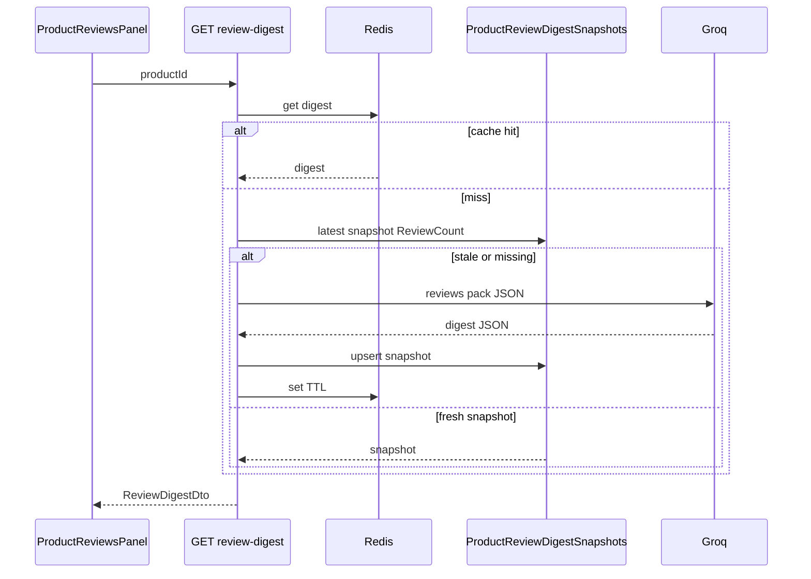

# AIDR — Solution: AI Review Digest (PDP)

**Status:** Implemented  
**Module:** 27–29 AI + Engagement  
**Use case:** UC-82 (View AI Review Digest) — enhance UC-59  
**Liên quan:** UC-59 (reviews), UC-56 (assistant — optional cross-link)  
**Phạm vi:** Trên PDP, hiển thị khối tóm tắt review do AI sinh: pros/cons, sentiment breakdown, grounded trên review thật.

---

## 1. Yêu cầu

> Buyer mở tab Reviews → thấy **AI Summary** trước danh sách review dài: 3–5 bullet ưu, 2–3 nhược, % Positive/Neutral/Negative.

### 1.1 Nguyên tắc

1. **Grounded only** — LLM chỉ được paraphrase từ review text đã load; không bịa spec / warranty.  
2. **Đủ review mới hiện** — tối thiểu **5 review visible**; dưới ngưỡng ẩn block hoặc hiện *"Not enough reviews yet"*.  
3. **Cache mạnh** — digest đổi khi có review mới / ẩn review; không gọi LLM mỗi page view.  
4. **Mock path** — `Groq:UseMock=true` → digest từ rule: top keywords + aggregate `SentimentLabel` nếu có.  
5. **English output** — UI + digest text English.

### 1.2 Không làm (v1)

- Digest realtime mỗi review mới (batch refresh OK).  
- Phân tích ảnh review.  
- Moderation tự động ẩn review tiêu cực.  
- Digest trên listing / search results.

---

## 2. Hiện trạng

| Đang có | Vấn đề |
|---------|--------|
| `ProductReviews` + list API paginated | User phải đọc từng review |
| Cột `SentimentLabel`, `SentimentScore` trên review | **Không populate** khi create/update review |
| `ProductReviewsPanel` FE | Chỉ list + filter rating |
| `AiCompareService`, `ILlmClient` | Pattern LLM + fallback sẵn |

---

## 3. Kiến trúc

```
GET /api/products/{id}/review-digest
  → ReviewDigestService
      1. Check cache (Redis + DB snapshot)
      2. If stale: load top N reviews (by helpful/recency — v1: newest 50 visible)
      3. Optional: batch sentiment nếu SentimentLabel null (Phase B)
      4. Build prompt / rule pack
      5. LLM JSON { pros[], cons[], summaryLine, sentimentPct }
      6. Persist snapshot + return
```



---

## 4. Schema

Script: `scripts/review-digest-schema.sql`

```sql
CREATE TABLE dbo.ProductReviewDigestSnapshots (
    ProductId       UNIQUEIDENTIFIER NOT NULL PRIMARY KEY,
    ReviewCount     INT              NOT NULL,
    DigestJson      NVARCHAR(MAX)    NOT NULL,  -- serialized DTO
    Source          NVARCHAR(20)     NOT NULL,  -- Groq | Heuristic
    GeneratedAt     DATETIME2(3)     NOT NULL,
    CONSTRAINT FK_Digest_Product FOREIGN KEY (ProductId) REFERENCES dbo.Products (ProductId)
);
```

**Phase B (optional):** populate `SentimentLabel` on review create via lightweight LLM/heuristic — không bắt buộc cho digest v1 (LLM đọc raw text).

Invalidate snapshot when:

- Review created / updated / soft-deleted for product  
- Admin hide review (nếu có)

Hook trong `ProductReviewService` sau create/update/delete → `IReviewDigestInvalidator.Invalidate(productId)`.

---

## 5. API & DTO

### GET `/api/products/{productId}/review-digest`

```json
{
  "available": true,
  "reviewCount": 42,
  "generatedAt": "2026-09-08T02:00:00Z",
  "source": "Groq",
  "summaryLine": "Most buyers praise battery life; a few mention heating under load.",
  "pros": ["Strong battery life", "Good value for money", "Fast delivery"],
  "cons": ["Gets warm when gaming", "Packaging could be better"],
  "sentiment": { "positive": 72, "neutral": 18, "negative": 10 }
}
```

`available: false` khi `< MinReviews` (config default 5).

Auth: **Guest** OK.

---

## 6. LLM contract

System prompt (English): summarize only from provided reviews; output strict JSON.

```json
{
  "summaryLine": "string max 200 chars",
  "pros": ["string max 80 chars", "..."],
  "cons": ["..."],
  "sentiment": { "positive": 0-100, "neutral": 0-100, "negative": 0-100 }
}
```

Input cap: 50 reviews × max 500 chars content ≈ 25k chars — truncate oldest if needed.

**Heuristic fallback (`UseMock`):**

- Tokenize frequent positive/negative words từ seed list (electronics domain).  
- `sentiment` từ average star rating buckets: 5→positive heavy, etc.

---

## 7. Frontend

`ProductReviewsPanel.tsx`:

- Block **AI Review Summary** phía trên filter (card với icon AI, disclaimer *"Generated from customer reviews"*).  
- Loading skeleton; empty state khi `available=false`.  
- Không hiển thị UC code.

CSS: `.review-digest` trong `catalog.css` — pros green-tint, cons amber-tint (brand `#16181D` accents).

---

## 8. Config

`appsettings.json`:

```json
"ReviewDigest": {
  "MinReviews": 5,
  "MaxReviewsInPrompt": 50,
  "CacheTtlMinutes": 60,
  "RegenerateOnInvalidate": true
}
```

Rate limit: max 10 digest regenerations / product / hour (Redis counter) — tránh abuse.

---

## 9. Seed & test

- `scripts/seed-review-digest.sql` — 1 SP với 15 review seed đa sentiment.  
- `POST /api/dev/seed-review-digest`  
- Manual: mở PDP → tab Reviews → thấy digest; thêm review → refresh → digest đổi sau invalidate.

---

## 10. Phases

| Phase | Deliverable |
|-------|-------------|
| **A** | Snapshot table + GET API + heuristic mock |
| **B** | Groq JSON + Redis cache + invalidate hooks |
| **C** | FE block + polish |
| **D** (opt) | Sentiment on review create for list badges |

---

## 11. Acceptance criteria

- [ ] SP ≥5 reviews → digest hiển thị ≤2s (cached).  
- [ ] SP <5 reviews → `available=false`, không gọi LLM.  
- [ ] Review mới → digest regenerate (hoặc stale flag).  
- [ ] `UseMock=true` → vẫn có digest hợp lệ.  
- [ ] Text English, không bịa tên spec không có trong review.
