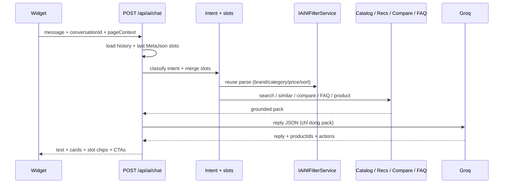

# AIDR — Solution: Smart Shopping Assistant (UC-56)

**Status:** Implemented (Phase 1–3)  
**Module:** 29 — AI Shopping Assistant  
**Use case:** UC-56 (enhance; không tạo UC mới)  
**Liên quan:** UC-90 (NL → filter), UC-28 (compare), UC-53/54 (recommend / similar)  
**Stack hiện tại:** `POST /api/ai/chat` (Buyer) · Groq JSON · heuristic fallback · `AiConversations` / `AiMessages`

---

## 1. Mục tiêu

Chatbot tư vấn mua sắm **hiểu ý định**, **nhớ ràng buộc qua nhiều lượt**, **retrieve catalog đúng filter**, trả lời **grounded** (không bịa id / giá / policy), và đưa CTA hữu ích trên widget.

### 1.1 Làm

- Intent routing + slot memory (brand, category, giá, rating, sort).
- Retrieve qua NL filter (UC-90) + Discovery search (không LIKE cả câu chat).
- Page context (PDP / compare tray) + personalize (UC-53/54) khi câu mơ hồ.
- FAQ grounded theo BR (return / payOS / voucher / shipping / warranty).
- FE: slot chips, contextual prompts, hydrate cards từ `MetaJson`, CTA “See all” / compare.

### 1.2 Không làm (v1)

- Native Groq function-calling loop / agent framework mới.
- SignalR / HTTP token streaming.
- Chat Guest (UC-56 = Buyer).
- Tra cứu đơn hàng / payOS / “where is my order”.
- Đổi schema SQL.
- Đổi LLM provider (giữ Groq; docs cũ ghi Ollama — không rollback).

---

## 2. Hiện trạng

Luồng hiện tại (`AiShoppingAssistantService`):

```
message
  → ExtractSearchQuery (strip punct, cắt 80 ký tự)
  → LIKE name/brand/description/tags  (8 SP)
  → Groq JSON { reply, productIds }   hoặc heuristic keyword FAQ
  → persist AiMessages + MetaJson { productIds, source }
```

### 2.1 Lỗ hổng

| Vấn đề | Hậu quả |
|---|---|
| Không dùng UC-90 | “Samsung phone under 15 triệu” không lọc brand / category / giá |
| History chỉ đưa vào LLM, không vào search | “rẻ hơn cái vừa rồi” không refine |
| Không biết user đang ở trang nào | Hỏi “máy này bảo hành bao lâu?” trên PDP → trả generic |
| Không dùng UC-53/54 | “gợi ý cho tôi” không personalize |
| Không dùng UC-28 trong chat | Không so sánh 2–5 SP từ hội thoại |
| `LooksLikeProductIntent` cứng | Miss intent hoặc gắn nhầm product card |
| Card SP chỉ là link | Không “See matching products”, Add to compare, lý do gợi ý |
| History hydrate yếu | Mở conversation cũ gần như mất cards |
| Docs nói streaming / Ollama | Thực tế HTTP request-response + Groq |

### 2.2 Tài sản tái sử dụng (không viết lại)

| Tài sản | Dùng cho |
|---|---|
| `IAiNlFilterService` | Parse brand / category / price / rating / sort |
| `ProductQueryRequest` + Discovery search | Retrieve Approved products đúng DSL |
| `IAiCompareService` | Compare-in-chat (Phase 3) |
| `IRecommendationService` | Browse / similar |
| `AiMessages.MetaJson` | Slot memory + product ids + actions — **không cần migration** |
| `nlResultToCatalogFilters` (FE) | CTA “See all matching products” |
| Heuristic FAQ trong assistant | Fallback khi Groq `UseMock` / fail |

---

## 3. Kiến trúc đề xuất

**Plan → Tools → Grounded reply.** Không agent loop. 1 lần Groq JSON (v1); tool **deterministic**. `UseMock` / Groq fail → cùng tool path, copy heuristic English.

```
┌─────────────┐     POST /api/ai/chat      ┌──────────────────────────────────┐
│  Widget FE  │  message + conversationId  │  AiShoppingAssistantService      │
│  + context  │  + pageContext             │                                  │
└─────────────┘ ─────────────────────────► │  1. Load history + last slots    │
                                           │  2. Intent + merge slots         │
                                           │  3. Tools (NL / Discovery /      │
                                           │     Recs / Similar / FAQ / SP)   │
                                           │  4. Groq grounded reply JSON     │
                                           │  5. Persist MetaJson             │
                                           └──────────────────────────────────┘
```



### 3.1 Vì sao không native tool-calling

- Groq trong repo đang dùng `json_object`, chưa wire function-calling.
- Heuristic fallback bắt buộc khi `UseMock`.
- 2+ roundtrip Groq làm chậm (timeout client đã cấu hình).
- Intent hữu hạn (recommend / refine / FAQ / product QA / compare) — router đủ.

Nếu 1 JSON call (plan+reply sau retrieve heuristic) kém chất lượng → **v1.1:** tách 2 call (plan rồi reply). Bắt đầu **1 call**.

---

## 4. Intent router

| Intent | Khi nào | Tool |
|---|---|---|
| `recommend` | muốn mua / gợi ý / ngân sách | NL filter + Discovery search |
| `refine` | “rẻ hơn”, “Apple đi”, “từ 4 sao” | merge slot cũ + search lại |
| `product_qa` | đang xem 1 SP / hỏi specs, warranty SP | load SP + `SpecsJson` |
| `compare` | so sánh 2–N máy | `IAiCompareService` (Phase 3) |
| `faq` | return, ship, pay, voucher, warranty **policy** | FAQ grounded theo BR |
| `browse` | mơ hồ (“có gì hay”) | UC-53 recommendations (+ viewed) |
| `clarify` | thiếu slot quan trọng | hỏi **1** câu, không dump SP lệch |
| `smalltalk` | chào / cảm ơn | trả ngắn + quick prompts |

Heuristic keyword **vẫn** là fallback khi Groq tắt — nhưng search **phải** qua filter, không LIKE nguyên câu.

**Clarify rule:** thiếu **cả** category lẫn budget → hỏi 1 câu, 0 card. Đủ 1 trong 2 → search được.

---

## 5. Slot memory (multi-turn)

Mỗi lượt assistant ghi `MetaJson` (cột đã có; comment schema: *parsed filters, product ids*):

```json
{
  "source": "groq",
  "intent": "refine",
  "slots": {
    "q": null,
    "brand": "Samsung",
    "categoryId": 12,
    "categoryName": "Phones",
    "minPrice": null,
    "maxPrice": 15000000,
    "minRating": 4,
    "sort": "rating"
  },
  "productIds": ["11111111-1111-1111-1111-111111111111"],
  "reasons": {
    "11111111-1111-1111-1111-111111111111": "Fits budget; 4.6★; in stock"
  },
  "actions": [
    { "type": "open_catalog", "label": "See all matching products" },
    { "type": "open_compare", "productIds": ["...", "..."] }
  ]
}
```

### 5.1 Merge rule

- Turn mới **ghi đè** field được nhắc (“switch to Apple” → `brand = Apple`).
- Field không nhắc **giữ**.
- “cheaper / under X” chỉ sửa `maxPrice` và/hoặc `sort`.
- `startNew` / nút New chat **xóa** slots (conversation mới).

NL query đưa vào UC-90 = message hiện tại **nối** slot cũ, ví dụ:

`Samsung phones under 15 million, cheaper`

Sanitize giống `AiNlFilterService` (category whitelist, cap giá, `MergeWithHeuristic`).

---

## 6. Page context (FE → BE)

Mở rộng `AiChatRequest` — field mới **optional**, client cũ không gửi vẫn chạy:

```json
{
  "conversationId": "aaaaaaaa-aaaa-aaaa-aaaa-aaaaaaaaaa56",
  "message": "Is the warranty enough for daily use?",
  "context": {
    "path": "/products/{id}",
    "productId": "eeeeeeee-eeee-eeee-eeee-eeeeeeeeeeee",
    "compareProductIds": ["...", "..."]
  }
}
```

Widget gắn từ `useLocation` + compare selection (Redux).

| Context | Ưu tiên intent |
|---|---|
| PDP `/products/{id}` + hỏi specs/warranty/this | `product_qa` |
| PDP + “alternative / similar” | similar (UC-54) |
| Compare tray ≥ 2 + “which is better?” | `compare` (Phase 3) |
| Cart / checkout + voucher/shipping | `faq` |

---

## 7. Tool layer

Tất cả tool **không tin LLM** — validate id thuộc pack, giá/tên/specs từ DB.

### 7.1 Catalog search (thay LIKE)

`IAiCatalogRepository.SearchApprovedProductsAsync(string query)` hiện LIKE cả câu.

Đổi / thêm overload:

```csharp
Task<IReadOnlyList<AiCompareProductRecord>> SearchApprovedProductsAsync(
    ProductQueryRequest query,
    int take,
    CancellationToken cancellationToken = default);
```

Dùng **cùng predicate** Discovery (`q`, `CategoryId`, `Brand`, `MinPrice`, `MaxPrice`, `MinRating`, `Sort`). Chỉ `Approved` + category active + shop `Active`.

Brand: normalize giống NL filter (`iphone` → `Apple`) vì Discovery brand là exact-match.

### 7.2 NL filter

Inject `IAiNlFilterService` vào assistant. Không gọi HTTP nội bộ.

### 7.3 Recommendations / similar

- `browse` hoặc `recommend` không có filter rõ → `GetRecommendationsAsync(userId)`.
- “alternative to this” / PDP → `GetSimilarProductsAsync(context.productId)`.

### 7.4 Compare (Phase 3)

2–5 id từ: mention trong message, `context.compareProductIds`, hoặc **last suggested** `productIds` trong MetaJson.

Reuse `IAiCompareService.CompareAsync` — summary + highlights nhét vào grounded pack, không bịa bảng specs.

### 7.5 FAQ grounded

Map topic → đoạn policy cố định (English). LLM **chỉ được paraphrase**, không thêm điều kiện mới.

| Topic | Nguồn chân lý |
|---|---|
| Return / refund | BR-R01–R05: chỉ ReturnRefund, không exchange, video Unboxing + Testing, refund trước rồi `RefundDebit` wallet |
| Shipping | Paid → Processing → Shipped → Delivered; Confirm received |
| Payment | payOS; Unpaid có thể cancel (BR-O01) |
| Voucher | System (Admin) / Shop (Seller); min order, expiry, usage limit |
| Warranty policy | Tháng BH nằm trên PDP; claim qua Chat shop |

### 7.6 Grounding cứng

- `productIds` **chỉ** lấy từ pack (catalog hits / recs / similar / compare).
- Không invent GUID, giá, stock, specs.
- Hết hàng (`AvailableQuantity = 0`) → nói hết hàng, không CTA Add to cart.
- Max 5 suggested products (`AiConstants.MaxSuggestedProducts`).

---

## 8. LLM reply contract

System prompt: shopping assistant marketplace điện tử đa vendor; **Reply in clear English**; concise 2–5 bullets; ask **at most one** clarifying question.

```json
{
  "reply": "string",
  "productIds": ["guid from pack only"],
  "reasons": { "<guid>": "one short why" },
  "actions": [
    { "type": "open_catalog|open_compare|open_product|none", "label": "..." }
  ]
}
```

User gõ tiếng Việt **được** (UC-90 đã parse VI+EN). Output UI/chat **luôn English**.

Parse fail / empty reply → heuristic reply trên **cùng pack** (không LIKE lại).

---

## 9. API / persistence

| Hạng mục | Quyết định |
|---|---|
| Endpoint | Giữ `POST /api/ai/chat`, `GET /api/ai/conversations`, `GET /api/ai/conversations/{id}` |
| Auth | `[Authorize(Policy = "Buyer")]` |
| Schema SQL | **Không đổi** |
| Conversation title | Giữ: lấy từ message đầu (cắt `MaxChatTitleLength`) |
| Rate limit | Giữ AI rate-limit hiện có |
| Latency | Parallel: history + last slots + (viewed ids nếu browse). Target < `Groq:TimeoutSeconds` |

`AiChatResultDto` mở rộng **optional** (FE cũ ignore field lạ):

- `intent`
- `slots` (filter đang nhớ)
- `actions`
- `suggestedProducts[].reason`

History: hydrate cards + actions từ `assistant.MetaJson.productIds` khi `GET conversation` (load product records theo id, skip SP không còn Approved).

---

## 10. Frontend

Giữ floating widget `ShoppingAssistantWidget` + class `aidr-assistant-*`. Không invent layout lệch theme storefront.

### 10.1 Gửi context

Mỗi `send()` đính `context` từ route + `selectCompareSelection`.

### 10.2 Slot chips

`Samsung · Phones · ≤ 15.000.000 ₫ · 4★+`  
Clear chip / New chat xóa memory phía FE (conversation mới).

### 10.3 Quick prompts theo route

| Route | Gợi ý |
|---|---|
| Default / empty chat | Returns, voucher, “Recommend a phone under my budget”, shipping |
| PDP | “Warranty on this item”, “Similar alternatives”, “Compare with similar” |
| Catalog | “Under 10 million”, “Best rated in this category” |
| Cart / checkout | “What vouchers can I use at checkout?” |

### 10.4 Product cards

- 1 dòng `reason` nếu có.
- Link PDP (như hiện tại).
- Add to compare (reuse `toggleCompareSelection`).
- CTA “See all matching products” → `/products` + `nlResultToCatalogFilters(slots)`.
- Phase 3: “Compare these” khi ≥ 2 cards → `/compare` hoặc gọi `runCompare`.

### 10.5 History

Khi `openConversation`, parse `metaJson` → `suggestedProducts` + `actions` (hydrate từ API detail nếu BE đã resolve cards).

Composer: giữ counter + Enter-to-send; disabled khi sending / empty. Không hiện lỗi required lúc mở panel.

---

## 11. Phased delivery

### Phase 1 — Retrieve + memory (impact lớn nhất)

- NL filter + Discovery search trong chat.
- Slot merge + `MetaJson` slots / reasons.
- FAQ grounded.
- Heuristic fallback **cùng** filter path.
- Reply JSON + `suggestedProducts[].reason`.

### Phase 2 — Context + FE

- `AiChatRequest.context`.
- `product_qa` + SpecsJson / WarrantyMonths.
- Recs / similar khi browse hoặc PDP alternatives.
- Slot chips, contextual prompts, See all, hydrate history cards.

### Phase 3 — Compare-in-chat

- Intent `compare` → `IAiCompareService`.
- CTA compare trên cards / tray.
- Quick prompt PDP “Compare with similar”.

### Phase 4 — Sau (nếu cần)

- HTTP streaming / SignalR token.
- Order-status tool.
- Guest chat (đổi UC — không làm nếu chưa có yêu cầu).

**Đề xuất implement trước:** Phase 1 + 2. Phase 3 nếu còn bandwidth.

---

## 12. Acceptance criteria (Phase 1–2)

1. “Samsung phone under 15 million” → chỉ SP Approved đúng brand/category/giá (không LIKE nguyên câu).
2. Lượt sau “Cheaper ones” / “rẻ hơn” → giữ Samsung + phone, hạ `maxPrice` hoặc sort `price_asc`.
3. Trên PDP, “How long is the warranty?” → `WarrantyMonths` của SP đang xem, không list random.
4. “How do returns work?” → policy AIDR (no exchange, Unboxing + Testing video), không bịa card.
5. Câu mơ hồ “What should I buy?” → recs (UC-53) hoặc 1 câu clarify, không dump bestseller lệch ngữ cảnh.
6. Groq down / `UseMock=true` → cùng filter retrieve, copy English heuristic.
7. Không invent product id / price / stock.
8. New chat xóa slots; history mở lại vẫn hiện cards từ MetaJson.
9. UI copy English; không hiện mã UC trên widget.
10. Seed demo (`scripts/seed-ai-assistant.sql` + `POST /api/dev/seed-ai-assistant`) cập nhật turn refine + PDP-style FAQ để test tay.

---

## 13. Rủi ro & mitigation

| Rủi ro | Mitigation |
|---|---|
| 2× Groq → chậm / timeout | Phase 1: 1 completion; NL heuristic chạy song song với pack |
| LLM bịa `categoryId` / giá | Sanitize như UC-90: whitelist category, cap giá, `MergeWithHeuristic` |
| Brand exact-match Discovery miss | Normalize brand (`iphone` → Apple) trước query |
| Slot merge sai (“Apple đi” vẫn giữ Samsung) | Field được mention **ghi đè**; test case refine brand |
| Context PDP stale (user đã rời trang) | Gửi `path` + `productId` **theo request**, không cache context server-side |
| Prompt injection (“ignore catalog”) | Tool chỉ search Approved; reply chỉ được cite pack |

---

## 14. File chạm khi implement (dự kiến)

### Backend

- `AIDR.Shared/Dtos/AI/ChatDtos.cs` — `context`, `slots`, `actions`, `reason`
- `AIDR.Modules/AI/Services/AiShoppingAssistantService.cs` — pipeline mới
- `AIDR.Modules/AI/Abstractions/IAiCatalogRepository.cs` + `AiCatalogRepository.cs` — search theo `ProductQueryRequest`
- `AIDR.Infrastructure/AI/AiConversationRepository.cs` — hydrate products từ MetaJson khi get detail (nếu làm ở repo/service)
- `AIDR.Shared/Constants/AiConstants.cs` — intent names / meta keys nếu cần
- `scripts/seed-ai-assistant.sql` + `AiAssistantDemoSeeder.cs`

Không đổi `database.sql`.

### Frontend

- `types/ai.ts`, `services/aiApi.ts`, `store/aiSlice.ts`, `hooks/useAi.ts`
- `components/ai/ShoppingAssistantWidget.tsx`
- `styles/chat.css` — chips / reason line / CTA, bám class hiện có
- Reuse `nlResultToCatalogFilters` từ `NlSearchBar.tsx` (export helper nếu chưa)

### Docs sau khi ship

- `usecase.md` — UC-56 giữ **Done** (enhance); ghi chú 1 dòng nếu muốn
- `architecture-aidr-be.md` §6.7 / `architecture-aidr-fe.md` §10 — cập nhật body `context` + MetaJson slots
- `plan-implement-module.md` — module 29 vẫn Done

---

## 15. Quyết định đã chốt / còn mở

| # | Câu hỏi | Default đề xuất |
|---|---|---|
| 1 | Scope implement | Phase 1 + 2; Phase 3 nếu kịp |
| 2 | Ngôn ngữ reply | Luôn English, kể cả user gõ tiếng Việt |
| 3 | Deep-link catalog | Có trong Phase 2 (“See all matching products”) |
| 4 | Streaming | Phase 4 |
| 5 | Guest chat | Không (ngoài UC-56) |

Khi implement: đặt UC-56 / module 29 **In Progress** trong lúc làm, xong test + seed → **Done** lại.
