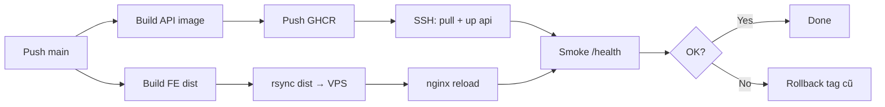

# AIDR - Solution: Kế hoạch deploy Production

**Phạm vi:** hướng dẫn triển khai website AIDR lên production với **VPS + Docker + NGINX + CI/CD (GitHub Actions)** - kiến trúc, cấu hình từng thành phần, runbook từng phase, ước tính chi phí, checklist go-live.  
**Tham chiếu:** `architecture-aidr-be.md`, `architecture-aidr-fe.md`, `docker-compose.yml`, `docs/handover-run-src.md`, `docs/guide-payos-settlement-testing.md`.

> **Lưu ý:** Giá dịch vụ cloud thay đổi theo thời điểm và khu vực. Các con số dưới đây là **ước tính tham khảo** (Q3–Q4 2025, quy đổi ~25.000 VND/USD). Luôn kiểm tra bảng giá chính thức trước khi mua.
>
> **Bắt đầu nhanh (làm theo từng bước):** [`docs/guide-deploy-vps-step-by-step.md`](guide-deploy-vps-step-by-step.md) - VPS all-in-one, **SQL Server trong Docker** (không bắt buộc Azure SQL).  
> Tài liệu này (§1–§5) là kiến trúc + chi phí + CI/CD chi tiết.

---

## 1. Tổng quan kiến trúc Production

### 1.1 Sơ đồ đề xuất (MVP - VPS + Docker + NGINX)

```
                         ┌─────────────────────────────────────────┐
                         │  Cloudflare (DNS + optional CDN/WAF)    │
                         └──────────────────┬──────────────────────┘
                                            │ HTTPS :443
                                            ▼
                         ┌─────────────────────────────────────────┐
                         │  VPS - Docker Compose                   │
                         │  NGINX (TLS + reverse proxy + FE dist)  │
                         │  api · redis · keycloak · kc-postgres   │
                         └──────────────────┬──────────────────────┘
              ┌─────────────────────────────┼─────────────────────────────┐
              ▼                             ▼                             ▼
     www / apex (static)           api ( /api + /hubs )          auth (Keycloak)
                                            │
              ┌─────────────────────────────┼─────────────────────────────┐
              ▼                             ▼                             ▼
     SQL Server (managed)            Redis (trên VPS)            payOS · GHN · Groq
     Azure SQL / tương đương                                   FPT.AI · SMTP · Cloudinary
```

CI/CD: **GitHub Actions** build image API → **GHCR** → SSH VPS `compose pull/up`; build FE → rsync `dist/` → `nginx reload`.
### 1.2 Domain & subdomain gợi ý

| Subdomain | Dịch vụ | Ghi chú |
|-----------|---------|---------|
| `www` hoặc apex | Frontend SPA (`aidr-fe`) | Cloudflare Pages / object storage + CDN |
| `api` | NGINX + .NET API + SignalR `/hubs` | Bắt buộc WebSocket cho chat/notification |
| `auth` | Keycloak | Hoặc path `/auth/` qua cùng NGINX (như `infra/nginx/nginx.conf` dev) |

**Khuyến nghị production:** tách `auth.` riêng subdomain để cấu hình Google OAuth / Keycloak redirect URI rõ ràng.

### 1.3 Hai mô hình triển khai

| Mô hình | Phù hợp | Ưu | Nhược |
|---------|---------|-----|-------|
| **A - VPS + Docker + NGINX + CI/CD (chuẩn vận hành)** | Go-live MVP / staging → prod | Một stack kiểm soát được: reverse proxy, container, pipeline | Single VPS = SPOF; cần tự backup/monitor |
| **B - Tách lớp CDN** | Traffic lớn, FE global | FE trên Cloudflare Pages, API trên VPS | Nhiều điểm cấu hình hơn |

**Chuẩn làm việc hiện tại:** all-in-one VPS (`docker-compose.prod.yml`) - FE static + API + **SQL Server container** + Redis + Keycloak + NGINX. Azure SQL là tùy chọn khi cần backup/HA managed. CI/CD: GitHub Actions → GHCR → SSH deploy (làm sau khi deploy tay ổn).

---

## 2. Checklist trước khi deploy

- [ ] Domain đã mua, DNS trỏ về Cloudflare (hoặc registrar).
- [ ] Chạy `database.sql` + các migration script trong `scripts/` (settlement, shipping, seller-kyc…) trên DB production.
- [ ] **Không** dùng secret dev trong `appsettings.json` - inject qua env / secret manager.
- [ ] Tắt hoặc chặn mọi endpoint `POST /api/dev/*` (chỉ `IsDevelopment()`).
- [ ] payOS: đăng ký **Chi hộ (Payouts)** nếu cần escrow settlement (xem `guide-payos-settlement-testing.md`).
- [ ] Webhook public HTTPS: payOS, GHN (nếu bật auto-fulfillment).
- [ ] SSL/TLS trên mọi endpoint public.
- [ ] Backup DB tự động + kế hoạch restore đã test.
- [ ] Smoke test: `/api/health/live`, `/api/health/ready`, login, checkout, webhook payOS.

---

## 3. Chi tiết từng thành phần

### 3.1 Frontend - `aidr-fe` (React + Vite)

#### Vai trò

SPA storefront + admin/seller; upload ảnh trực tiếp lên Cloudinary; gọi API và SignalR qua HTTPS.

#### Build & host

```bash
cd aidr-fe
cp .env.example .env.production
# Điền biến VITE_* (xem bảng dưới)
npm ci
npm run build
# Output: dist/ - deploy lên static host
```

#### Biến môi trường (`aidr-fe/.env.production`)

| Biến | Production ví dụ | Mô tả |
|------|------------------|-------|
| `VITE_API_BASE_URL` | `https://api.aidr.example.com/api` | Base URL REST (hoặc `/api` nếu cùng origin qua reverse proxy) |
| `VITE_SIGNALR_HUB_URL` | `https://api.aidr.example.com/hubs` | Hub SignalR (WebSocket) |
| `VITE_KEYCLOAK_URL` | `https://auth.aidr.example.com` | Keycloak base URL |
| `VITE_KEYCLOAK_REALM` | `aidr` | Realm |
| `VITE_KEYCLOAK_CLIENT_ID` | `aidr-fe` | Public client |
| `VITE_AUTH_GOOGLE_REDIRECT_URI` | `https://www.aidr.example.com/auth/callback` | Redirect sau Google login |
| `VITE_CLOUDINARY_CLOUD_NAME` | `your_cloud` | Cloudinary cloud name |
| `VITE_CLOUDINARY_UPLOAD_PRESET` | `aidr_unsigned` | Unsigned upload preset |

> Biến `VITE_*` được **nhúng vào bundle lúc build** - cần build lại khi đổi domain.

#### Lựa chọn hosting & chi phí

| Nền tảng | Cấu hình gợi ý | Chi phí ước tính/tháng |
|----------|----------------|------------------------|
| **Cloudflare Pages** | Connect Git, build `npm run build`, output `dist` | **$0** (Free) - bandwidth rộng |
| **Vercel / Netlify** | Tương tự Pages | **$0–20** |
| **S3 + CloudFront** | Bucket private + OAI | **$1–10** (traffic thấp) |
| **Cùng VPS với NGINX** | Serve `dist/` static | $0 thêm (đã tính trong VPS) |

**Khuyến nghị:** Cloudflare Pages (miễn phí, CDN toàn cầu, preview branch cho staging).

#### Cấu hình bổ sung

- **SPA fallback:** mọi route không phải file tĩnh → `index.html` (Pages/Vercel tự xử lý).
- **Security headers:** `X-Frame-Options`, `X-Content-Type-Options`, CSP (tùy mức độ).
- **Không** expose API key Groq/payOS trên FE - chỉ Cloudinary unsigned preset (public by design).

---

### 3.2 Backend API - `aidr-be` (.NET 9)

#### Vai trò

REST API, SignalR hubs (chat, notification), background jobs (settlement, shipping), tích hợp payOS/GHN/Groq/FPT.AI/SMTP.

#### Docker image

Đã có `aidr-be/AIDR.Api/Dockerfile` - publish port `8080` trong container.

```bash
cd aidr-be
docker build -f AIDR.Api/Dockerfile -t aidr-api:latest .
```

#### Biến môi trường chính (override `appsettings.json`)

ASP.NET Core dùng `__` (double underscore) cho nested config:

```bash
# Core
ASPNETCORE_ENVIRONMENT=Production
ConnectionStrings__AidrDb=Server=...;Database=AIDR;User Id=...;Password=...;Encrypt=True;TrustServerCertificate=False;
ConnectionStrings__Redis=redis-host:6379,password=...
Caching__UseInMemory=false

# JWT (nếu dùng login email/password nội bộ song song Keycloak)
Jwt__SigningKey=<random-64-chars-min>
Jwt__Issuer=aidr-api
Jwt__Audience=aidr-fe

# Keycloak
Keycloak__Authority=https://auth.aidr.example.com/realms/aidr
Keycloak__Audience=aidr-api
Keycloak__RequireHttpsMetadata=true
Keycloak__BaseUrl=https://auth.aidr.example.com
Keycloak__Realm=aidr
Keycloak__FrontendClientId=aidr-fe
Keycloak__GoogleIdpAlias=google

# Auth URLs
Auth__FrontendResetPasswordUrl=https://www.aidr.example.com/reset-password

# CORS - chỉ origin production
Cors__Origins__0=https://www.aidr.example.com
Cors__Origins__1=https://aidr.example.com

# SMTP
Smtp__Enabled=true
Smtp__Host=smtp.sendgrid.net
Smtp__Port=587
Smtp__EnableSsl=true
Smtp__Username=apikey
Smtp__Password=<sendgrid-api-key>
Smtp__From=noreply@aidr.example.com
Smtp__FromDisplayName=AIDR

# payOS (production credentials - KHÔNG dùng sandbox)
PayOS__ClientId=...
PayOS__ApiKey=...
PayOS__ChecksumKey=...
PayOS__UseMock=false
PayOS__ReturnUrl=https://www.aidr.example.com/order-received
PayOS__CancelUrl=https://www.aidr.example.com/order-received?cancelled=1

# Settlement
Settlement__CommissionRate=0.03
Settlement__HoldDays=30
Settlement__AutoCompleteDays=7
Settlement__PayoutMode=PayOs
Settlement__EnableBackgroundJob=true

# GHN (production gateway)
Shipping__Provider=GHN
Shipping__EnableAutoFulfillment=true
Shipping__Ghn__BaseUrl=https://online-gateway.ghn.vn
Shipping__Ghn__Token=...
Shipping__Ghn__ShopId=...
Shipping__Ghn__WebhookToken=<random-secret>

# Groq AI
Groq__ApiKey=...
Groq__Model=llama-3.3-70b-versatile
Groq__UseMock=false

# FPT.AI eKYC
FptAi__ApiKey=...
FptAi__UseMock=false
FptAi__AllowedImageHosts__0=res.cloudinary.com
```

#### Hosting & chi phí

| Option | Spec gợi ý | Chi phí/tháng |
|--------|------------|---------------|
| **VPS** (Vultr, DO, Lightsail) | 2 vCPU, 4 GB RAM | **$12–24** (~300k–600k VND) |
| **VPS scale** | 4 vCPU, 8 GB RAM | **$24–48** |
| **Azure App Service** | B1/B2 Linux container | **$13–55** |
| **AWS ECS Fargate** | 0.5 vCPU, 1 GB | **$15–40** + ALB |

**Khuyến nghị MVP:** 1 VPS 4 GB chạy `api` + `nginx` + `redis` (container); Keycloak có thể cùng máy hoặc tách 2 GB riêng.

#### Health check

| Endpoint | Mục đích |
|----------|----------|
| `GET /api/health/live` | Liveness - process sống |
| `GET /api/health/ready` | Readiness - SQL + Redis |

Cấu hình load balancer / orchestrator probe vào 2 endpoint này.

---

### 3.3 NGINX - Reverse proxy

#### Vai trò

Terminate HTTPS (hoặc Cloudflare origin), proxy `/api/` và `/hubs/` (WebSocket) tới API, proxy `/auth/` tới Keycloak.

Tham khảo cấu hình dev: `infra/nginx/nginx.conf`.

#### Production `nginx.conf` (điểm khác so với dev)

```nginx
# Bổ sung so với dev:
# - listen 443 ssl http2
# - ssl_certificate / ssl_certificate_key (hoặc Cloudflare Origin Cert)
# - client_max_body_size 20m (upload qua API nếu có)
# - proxy_read_timeout 3600s cho SignalR WebSocket
# - real_ip từ Cloudflare (set_real_ip_from + CF-Connecting-IP)

location /hubs/ {
    proxy_pass http://aidr_api;
    proxy_http_version 1.1;
    proxy_set_header Upgrade $http_upgrade;
    proxy_set_header Connection "upgrade";
    proxy_set_header Host $host;
    proxy_read_timeout 3600s;
    proxy_send_timeout 3600s;
}
```

#### Chi phí

Chạy trên cùng VPS với API → **$0 thêm**.  
Managed load balancer (AWS ALB, Azure LB): **$15–25/tháng** nếu cần HA multi-AZ.

---

### 3.4 SQL Server - Database

#### Vai trò

Source of truth - toàn bộ schema trong `database.sql` + scripts `scripts/*.sql`.

#### Lựa chọn & chi phí

| Provider | Tier gợi ý | Chi phí/tháng | Ghi chú |
|----------|------------|---------------|---------|
| **Azure SQL Database** | Basic / S0 (10 DTU) | **$5–15** | Gần VN (Southeast Asia), backup tự động |
| **Azure SQL** | S1 (20 DTU) | **~$30** | Traffic vừa |
| **Aiven for SQL Server** | Startup | **~$50–120** | Đúng như architecture doc |
| **AWS RDS SQL Server** | db.t3.small | **~$50–80** | License SQL Server đắt hơn PostgreSQL |
| **SQL trên VPS** (compose) | 2 GB RAM dedicated | $0 thêm | **Không khuyến nghị prod** - tự backup, không HA |

**Khuyến nghị MVP:** Azure SQL Basic/S0 + automated backup 7–35 ngày.

#### Cấu hình

1. Tạo database `AIDR`.
2. Chạy `database.sql`.
3. Chạy lần lượt (nếu chưa có trong schema gốc):
   - `scripts/settlement-schema.sql`
   - `scripts/seller-kyc-schema.sql`
   - `scripts/shipping-schema.sql`
4. Connection string production: `Encrypt=True`, user riêng (không `sa`), firewall chỉ IP app server.
5. **Không** seed demo trên production (`/api/dev/seed-*`).

#### Backup

| Hạng mục | Chi phí |
|----------|---------|
| Azure automated backup (included) | Trong giá SQL tier |
| Point-in-time restore | Included (Basic: 7 ngày) |
| Export manual → storage | **~$0.02/GB/tháng** |

---

### 3.5 Redis - Cache & SignalR backplane (tùy chọn)

#### Vai trò

Cache catalog, session phụ, rate limit. Nếu scale **nhiều instance API**, cần Redis làm SignalR backplane.

#### Lựa chọn & chi phí

| Option | Chi phí/tháng |
|--------|---------------|
| Container trên cùng VPS | **$0** |
| **Upstash Redis** (serverless) | **$0–10** (free tier có giới hạn) |
| **Redis Cloud** 250 MB | **$0–7** |
| **Azure Cache for Redis** Basic C0 | **~$16** |

**MVP 1 instance API:** Redis container trên VPS đủ dùng.  
**Scale horizontal:** Upstash hoặc Azure Cache.

```bash
ConnectionStrings__Redis=your-redis:6379,password=...,ssl=True,abortConnect=False
Caching__UseInMemory=false
```

---

### 3.6 Keycloak - Identity (IAM)

#### Vai trò

OAuth2/OIDC, login email, Google federated IdP, roles BUYER/SELLER/ADMIN.

Realm import: `infra/keycloak/aidr-realm.json` - **phải cập nhật** trước production:

| Mục | Production |
|-----|------------|
| `redirectUris` client `aidr-fe` | `https://www.aidr.example.com/*` |
| `webOrigins` | `https://www.aidr.example.com` |
| Google IdP | Bật + Client ID/Secret thật |
| `sslRequired` | `external` hoặc `all` |
| Admin console | Đổi `KEYCLOAK_ADMIN_PASSWORD` mạnh |

#### Chạy production (không dùng `start-dev`)

```yaml
command: ["start", "--import-realm", "--optimized"]
environment:
  KC_DB: postgres  # hoặc mssql - Keycloak 26 khuyến nghị Postgres riêng
  KC_HOSTNAME: auth.aidr.example.com
  KC_PROXY: edge          # đứng sau Cloudflare/NGINX
  KC_HTTP_ENABLED: "true"
```

#### Hosting & chi phí

| Option | Chi phí/tháng |
|--------|---------------|
| Container trên VPS API (thêm ~512 MB–1 GB RAM) | **$0** thêm |
| VPS riêng 2 GB cho Keycloak + Postgres | **$6–12** |
| **Keycloak managed** (Phase Two, etc.) | **$25–100+** |

**Khuyến nghị MVP:** Keycloak container + Postgres container trên cùng VPS 4–8 GB.

#### Google OAuth

1. [Google Cloud Console](https://console.cloud.google.com/) → OAuth 2.0 Client.
2. Authorized redirect URI:  
   `https://auth.aidr.example.com/realms/aidr/broker/google/endpoint`
3. Cập nhật IdP trong Keycloak Admin hoặc realm JSON.

**Chi phí Google OAuth:** **$0**.

---

### 3.7 Cloudinary - Media upload

#### Vai trò

Upload ảnh sản phẩm, avatar, eKYC (FE unsigned upload).

#### Cấu hình

1. Tạo Cloudinary account → lấy `cloud_name`.
2. Settings → Upload → Add upload preset:
   - Signing mode: **Unsigned** (hoặc signed nếu muốn bảo mật hơn - cần sửa FE).
   - Folder: `aidr/products`, `aidr/avatars`…
   - Allowed formats: `jpg,png,webp`.
   - Max file size: 5–10 MB.
3. BE `FptAi:AllowedImageHosts` phải chứa `res.cloudinary.com`.

#### Chi phí

| Plan | Chi phí | Ghi chú |
|------|---------|---------|
| **Free** | **$0** | ~25 credits/tháng, đủ dev/MVP nhỏ |
| **Plus** | **~$99/tháng** | Production có traffic upload nhiều |
| Storage/bandwidth vượt quota | Pay-as-you-go | Xem dashboard |

---

### 3.8 payOS - Thanh toán & Chi hộ

#### Vai trò

Thu tiền buyer (payment link / VietQR), webhook xác nhận đơn, chi hộ seller/refund (Payouts API).

Chi tiết: `docs/guide-payos-settlement-testing.md`, `docs/solution-escrow-settlement.md`.

#### Cấu hình production

| Bước | Hành động |
|------|-----------|
| 1 | Đăng ký merchant **production** tại [payOS](https://payos.vn) |
| 2 | Lấy `ClientId`, `ApiKey`, `ChecksumKey` production |
| 3 | Đăng ký **Chi hộ (Payouts)** riêng - không tự có khi tạo kênh thanh toán |
| 4 | Nạp số dư tài khoản chi hộ để payout seller/refund |
| 5 | Webhook URL: `https://api.aidr.example.com/api/payments/payos/webhook` |
| 6 | Admin gọi `POST /api/payments/payos/confirm-webhook` sau deploy |
| 7 | `PayOS__ReturnUrl` / `CancelUrl` trỏ domain FE production |

#### Chi phí

| Hạng mục | Ước tính |
|----------|----------|
| Phí kích hoạt / duy trì tài khoản | Theo hợp đồng payOS (thường **miễn phí** hoặc phí thấp cho SME) |
| Phí giao dịch thu hộ | **~1.5–2%**/giao dịch (thương lượng theo volume) |
| Phí chi hộ (payout) | Theo bảng giá payOS (fixed + % tùy gói) |
| Không có phí cloud cố định | Chỉ trả theo giao dịch |

> Sandbox: **$0** - dùng cho staging.

---

### 3.9 GHN - Vận chuyển tự động

#### Vai trò

Tạo vận đơn sau thanh toán, webhook/poll cập nhật trạng thái đơn.

Chi tiết: `docs/solution-auto-fulfillment-shipping.md`.

#### Cấu hình production

```bash
Shipping__Ghn__BaseUrl=https://online-gateway.ghn.vn   # KHÔNG dùng dev-online-gateway
Shipping__Ghn__Token=<token từ GHN dashboard>
Shipping__Ghn__ShopId=<shop id production>
Shipping__Ghn__WebhookToken=<secret tự đặt>
```

Webhook GHN (nếu hỗ trợ): `https://api.aidr.example.com/api/shipping/ghn/webhook`

#### Chi phí

| Hạng mục | Ước tính |
|----------|----------|
| API access | **$0** (theo hợp đồng shop GHN) |
| Cước vận chuyển | Trả theo đơn - **không phải chi phí infra** |
| COD / bảo hiểm | Tùy gói GHN |

---

### 3.10 Groq - AI Shopping Assistant

#### Vai trò

LLM cho tư vấn mua hàng, so sánh sản phẩm (`Groq` section trong `appsettings.json`).

#### Cấu hình

```bash
Groq__ApiKey=gsk_...        # https://console.groq.com/keys
Groq__Model=llama-3.3-70b-versatile
Groq__UseMock=false
Groq__TimeoutSeconds=60
```

#### Chi phí

| Tier | Chi phí |
|------|---------|
| Free tier | **$0** - rate limit (RPM/TPM) |
| Pay-as-you-go | **~$0.05–0.79 / 1M tokens** tùy model |
| MVP ước tính | **$5–30/tháng** nếu vài nghìn phiên chat |

**Staging:** `Groq__UseMock=true` hoặc key riêng để tránh tốn quota prod.

---

### 3.11 FPT.AI - eKYC seller onboarding

#### Vai trò

OCR CCCD + face match khi đăng ký bán hàng.

Chi tiết: `docs/solution-seller-onboarding-ekyc.md`.

#### Cấu hình

```bash
FptAi__BaseUrl=https://api.fpt.ai
FptAi__ApiKey=<key từ FPT.AI dashboard>
FptAi__UseMock=false
FptAi__FaceMatchThreshold=0.80
FptAi__AllowedImageHosts__0=res.cloudinary.com
```

#### Chi phí

| Hạng mục | Ước tính |
|----------|----------|
| Gói API FPT.AI | **Theo request** - liên hệ sales hoặc dashboard |
| OCR + Face match / lượt KYC | **~2.000–10.000 VND/lượt** (tham khảo, tùy gói) |
| MVP (50 seller/tháng) | **~100k–500k VND/tháng** |

**Staging:** `FptAi__UseMock=true` - không tốn phí API.

---

### 3.12 SMTP - Email transactional

#### Vai trò

Reset password, thông báo email (nếu bật).

#### Lựa chọn & chi phí

| Provider | Free tier | Paid |
|----------|-----------|------|
| **SendGrid** | 100 email/ngày | **$19.95/tháng** (50k emails) |
| **Amazon SES** | 62k/tháng (từ EC2) | **$0.10/1k emails** |
| **Brevo (Sendinblue)** | 300 email/ngày | **~$9/tháng** |
| **Gmail SMTP** | ~500/ngày | **$0** - không khuyến nghị prod |

Cấu hình xem `aidr-be/AIDR.Api/.env.example`.

---

### 3.13 DNS, SSL, CDN - Cloudflare

#### Cấu hình DNS (ví dụ)

| Type | Name | Target |
|------|------|--------|
| CNAME | `www` | `aidr-fe.pages.dev` (hoặc VPS) |
| A / CNAME | `api` | IP VPS hoặc LB |
| A / CNAME | `auth` | IP VPS Keycloak |
| TXT | `@` | SPF (nếu gửi mail từ domain) |

#### SSL

- **Cloudflare Universal SSL:** **$0** (Full Strict + Origin Certificate cho VPS).
- Hoặc **Let's Encrypt** trên NGINX (certbot): **$0**.

#### Chi phí Cloudflare

| Plan | Chi phí/tháng |
|------|---------------|
| Free | **$0** - CDN, DNS, SSL, basic DDoS |
| Pro | **$20** - WAF rules, image polish |
| Business | **$200** - SLA cao hơn |

**Khuyến nghị MVP:** Cloudflare Free.

---

### 3.14 Domain

| Loại | Chi phí/năm |
|------|-------------|
| `.com` | **~$10–15** (~250k–375k VND) |
| `.vn` | **~300k–800k VND** (qua registrar VN) |

---

### 3.15 Monitoring & Logging (khuyến nghị)

Architecture doc đề cập Grafana + Serilog.

| Thành phần | Option | Chi phí/tháng |
|------------|--------|---------------|
| **Uptime probe** | UptimeRobot, Better Stack free | **$0** |
| **Logs** | Grafana Cloud free tier | **$0** (50 GB ingest) |
| **APM** | Application Insights (Azure) | **~$0–25** (free tier 5 GB) |
| **Self-host Prometheus + Grafana** | Trên VPS | **$0** thêm |

Health endpoints để alert:

- `https://api.aidr.example.com/api/health/ready` → fail nếu DB/Redis down.

---

## 4. Bảng tổng hợp chi phí theo giai đoạn

### 4.1 Staging (pre-production)

| Hạng mục | Chi phí/tháng |
|----------|---------------|
| Cloudflare Pages (FE staging branch) | $0 |
| VPS 2 GB (API + Redis + Keycloak dev mode) | $6–12 |
| Azure SQL Basic (hoặc SQL container) | $0–5 |
| Cloudflare Free | $0 |
| payOS sandbox, GHN dev, Groq free, FptAi mock | $0 |
| **Tổng staging** | **~$6–20/tháng** (~150k–500k VND) |

### 4.2 Production MVP (traffic thấp, < 1k DAU)

| Hạng mục | Chi phí/tháng |
|----------|---------------|
| Domain `.com` (chia 12) | ~$1 |
| Cloudflare Free + Pages | $0 |
| VPS 4 GB (API, NGINX, Redis, Keycloak) | $12–24 |
| Azure SQL S0 | $15–30 |
| SendGrid / SES | $0–10 |
| Cloudinary Free | $0 |
| Groq (usage thấp) | $0–10 |
| FPT.AI eKYC (theo lượt) | ~$5–20 |
| payOS | $0 cố định + % giao dịch |
| GHN | $0 API + cước ship |
| Monitoring free tier | $0 |
| **Tổng infra cố định** | **~$35–95/tháng** (~900k–2.4 triệu VND) |

### 4.3 Production vừa (scale, HA cơ bản)

| Hạng mục | Chi phí/tháng |
|----------|---------------|
| 2× VPS hoặc managed container | $50–100 |
| Azure SQL S1 + backup | $30–50 |
| Redis managed | $10–20 |
| Cloudflare Pro | $20 |
| Cloudinary Plus | $99 |
| SendGrid / SES | $20–50 |
| Groq + FPT.AI usage | $50–200 |
| **Tổng** | **~$280–540/tháng** (~7–13.5 triệu VND) |

> **Biến phí lớn nhất khi vận hành thật:** phí giao dịch payOS, cước GHN, AI API - tỷ lệ thuận với GMV và lượt dùng, không phải chi phí server.

---

## 5. Plan triển khai chi tiết - VPS + Docker + NGINX + CI/CD

Đây là **runbook vận hành chuẩn** cho AIDR. Mục tiêu: một VPS production ổn định, deploy tự động từ `main`, HTTPS, WebSocket SignalR hoạt động, không lộ secret.

### 5.1 Kiến trúc mục tiêu trên VPS

```
Internet
   │
   ▼
Cloudflare (DNS + proxy optional) ──► VPS :443 / :80
                                          │
                                    ┌─────▼─────┐
                                    │   NGINX   │
                                    │  (TLS)    │
                                    └─────┬─────┘
              ┌───────────────────────────┼───────────────────────────┐
              │                           │                           │
              ▼                           ▼                           ▼
     www / apex                    api.<domain>                auth.<domain>
     static FE (dist/)             /api → aidr-api:8080         → keycloak:8080
     SPA fallback                  /hubs → WebSocket
              │                           │
              │                           ▼
              │                      Redis :6379
              │                           │
              └───────────────────────────┼──► Azure SQL (managed, ngoài VPS)
                                          │
                                   payOS · GHN · Groq · FPT.AI · SMTP · Cloudinary
```

| Container | Image | Port nội bộ | Public? |
|-----------|-------|-------------|---------|
| `nginx` | `nginx:1.27-alpine` | 80/443 | **Có** (host 80/443) |
| `api` | `ghcr.io/<org>/aidr-api:<tag>` | 8080 | Không |
| `redis` | `redis:7-alpine` | 6379 | Không |
| `keycloak` | `quay.io/keycloak/keycloak:26.0` | 8080 | Không |
| `kc-db` | `postgres:16-alpine` | 5432 | Không (chỉ Keycloak) |

**Không** publish `1433`/`6379`/`8080` ra internet. Chỉ NGINX lắng nghe public.

### 5.2 Spec VPS & phần mềm nền

| Hạng mục | Staging | Production MVP |
|----------|---------|----------------|
| Provider | Contabo / Vultr / DigitalOcean / Lightsail / VNG | Cùng hoặc gần user VN |
| Spec | 2 vCPU, 4 GB RAM, 40 GB SSD | **4 vCPU, 8 GB RAM, 80 GB SSD** |
| OS | Ubuntu 24.04 LTS | Ubuntu 24.04 LTS |
| Swap | 2 GB | 4 GB |
| Firewall | UFW: 22 (SSH key only), 80, 443 | Giống + fail2ban |

Cài trên VPS (một lần):

```bash
# Docker Engine + Compose plugin
sudo apt update && sudo apt install -y ca-certificates curl ufw fail2ban
# Cài Docker theo docs.docker.com (ubuntu) - không dùng snap nếu có thể
sudo usermod -aG docker $USER

# Xác nhận
docker --version
docker compose version
```

SSH: tắt password login, chỉ key; user deploy không dùng `root` cho pipeline (sudo hạn chế hoặc group `docker`).

### 5.3 Layout thư mục trên VPS

```text
/opt/aidr/
├── docker-compose.prod.yml
├── .env                    # secrets - chmod 600, không git
├── nginx/
│   ├── nginx.conf
│   └── conf.d/
│       └── aidr.conf
├── certbot/                # nếu dùng Let's Encrypt volume
├── fe/                     # rsync/artifact dist/ từ CI
│   └── dist/
├── backups/                # dump DB / realm (nếu tự backup)
└── scripts/
    ├── deploy.sh
    └── healthcheck.sh
```

Repo GitHub **không** chứa `.env` production. Chỉ chứa template: `docker-compose.prod.yml`, `infra/nginx/*`, workflow CI.

### 5.4 `docker-compose.prod.yml` (mẫu)

Đặt tại `/opt/aidr/docker-compose.prod.yml` (hoặc `infra/docker-compose.prod.yml` trong repo, copy lên VPS).

```yaml
services:
  redis:
    image: redis:7-alpine
    restart: unless-stopped
    command: ["redis-server", "--requirepass", "${REDIS_PASSWORD}"]
    volumes:
      - redis_data:/data
    networks: [aidr]
    healthcheck:
      test: ["CMD", "redis-cli", "-a", "${REDIS_PASSWORD}", "ping"]
      interval: 10s
      timeout: 3s
      retries: 5

  kc-db:
    image: postgres:16-alpine
    restart: unless-stopped
    environment:
      POSTGRES_DB: keycloak
      POSTGRES_USER: keycloak
      POSTGRES_PASSWORD: ${KC_DB_PASSWORD}
    volumes:
      - kc_pg_data:/var/lib/postgresql/data
    networks: [aidr]

  keycloak:
    image: quay.io/keycloak/keycloak:26.0
    restart: unless-stopped
    command: ["start", "--optimized"]
    environment:
      KC_DB: postgres
      KC_DB_URL: jdbc:postgresql://kc-db:5432/keycloak
      KC_DB_USERNAME: keycloak
      KC_DB_PASSWORD: ${KC_DB_PASSWORD}
      KC_HOSTNAME: auth.${DOMAIN}
      KC_PROXY_HEADERS: xforwarded
      KC_HTTP_ENABLED: "true"
      KEYCLOAK_ADMIN: ${KC_ADMIN_USER}
      KEYCLOAK_ADMIN_PASSWORD: ${KC_ADMIN_PASSWORD}
    depends_on: [kc-db]
    networks: [aidr]

  api:
    image: ghcr.io/${GHCR_OWNER}/aidr-api:${API_IMAGE_TAG:-latest}
    restart: unless-stopped
    env_file: [.env]
    environment:
      ASPNETCORE_ENVIRONMENT: Production
      ASPNETCORE_URLS: http://+:8080
      ConnectionStrings__Redis: redis:6379,password=${REDIS_PASSWORD},abortConnect=False
      Caching__UseInMemory: "false"
    depends_on:
      redis:
        condition: service_healthy
    networks: [aidr]
    healthcheck:
      test: ["CMD", "curl", "-f", "http://localhost:8080/api/health/live"]
      interval: 15s
      timeout: 5s
      retries: 5
      start_period: 40s

  nginx:
    image: nginx:1.27-alpine
    restart: unless-stopped
    ports:
      - "80:80"
      - "443:443"
    volumes:
      - ./nginx/nginx.conf:/etc/nginx/nginx.conf:ro
      - ./nginx/conf.d:/etc/nginx/conf.d:ro
      - ./fe/dist:/var/www/aidr-fe:ro
      - ./certbot/conf:/etc/letsencrypt:ro
      - ./certbot/www:/var/www/certbot:ro
    depends_on: [api, keycloak]
    networks: [aidr]

volumes:
  redis_data:
  kc_pg_data:

networks:
  aidr:
    driver: bridge
```

Khác `docker-compose.yml` (dev):

| Dev | Production |
|-----|------------|
| SQL Server container + Mailhog | Azure SQL + SMTP thật |
| Keycloak `start-dev` | `start --optimized` + Postgres |
| Build API local | Pull image từ GHCR |
| FE Vite `:5173` | Static `dist/` qua NGINX |
| Port API/Keycloak expose | Chỉ 80/443 |

> Image API cần có `curl` trong stage final **hoặc** đổi healthcheck sang `wget`/dotnet - Dockerfile hiện tại không có curl; có thể healthcheck từ NGINX/host: `curl https://api.$DOMAIN/api/health/live`.

### 5.5 NGINX production - cấu hình mẫu

`nginx/nginx.conf` - worker + gzip + upstream:

```nginx
worker_processes auto;
events { worker_connections 2048; }

http {
    include       /etc/nginx/mime.types;
    default_type  application/octet-stream;
    sendfile      on;
    keepalive_timeout 65;
    client_max_body_size 20m;

    # Cloudflare real IP (nếu proxy cam)
    # set_real_ip_from ...; real_ip_header CF-Connecting-IP;

    upstream aidr_api { server api:8080; }
    upstream aidr_keycloak { server keycloak:8080; }

    include /etc/nginx/conf.d/*.conf;
}
```

`nginx/conf.d/aidr.conf` - 3 server blocks:

```nginx
# --- Frontend (www + apex) ---
server {
    listen 443 ssl http2;
    server_name www.aidr.example.com aidr.example.com;

    ssl_certificate     /etc/letsencrypt/live/aidr.example.com/fullchain.pem;
    ssl_certificate_key /etc/letsencrypt/live/aidr.example.com/privkey.pem;

    root /var/www/aidr-fe;
    index index.html;

    location / {
        try_files $uri $uri/ /index.html;
    }

    location ~* \.(js|css|png|jpg|jpeg|gif|ico|svg|woff2?)$ {
        expires 7d;
        add_header Cache-Control "public, immutable";
    }

    add_header X-Frame-Options "SAMEORIGIN" always;
    add_header X-Content-Type-Options "nosniff" always;
}

# --- API + SignalR ---
server {
    listen 443 ssl http2;
    server_name api.aidr.example.com;

    ssl_certificate     /etc/letsencrypt/live/aidr.example.com/fullchain.pem;
    ssl_certificate_key /etc/letsencrypt/live/aidr.example.com/privkey.pem;

    location /api/ {
        proxy_pass http://aidr_api;
        proxy_http_version 1.1;
        proxy_set_header Host $host;
        proxy_set_header X-Real-IP $remote_addr;
        proxy_set_header X-Forwarded-For $proxy_add_x_forwarded_for;
        proxy_set_header X-Forwarded-Proto $scheme;
        proxy_set_header X-Correlation-Id $request_id;
    }

    location /hubs/ {
        proxy_pass http://aidr_api;
        proxy_http_version 1.1;
        proxy_set_header Upgrade $http_upgrade;
        proxy_set_header Connection "upgrade";
        proxy_set_header Host $host;
        proxy_set_header X-Forwarded-Proto $scheme;
        proxy_read_timeout 3600s;
        proxy_send_timeout 3600s;
        proxy_cache_bypass $http_upgrade;
    }
}

# --- Keycloak ---
server {
    listen 443 ssl http2;
    server_name auth.aidr.example.com;

    ssl_certificate     /etc/letsencrypt/live/aidr.example.com/fullchain.pem;
    ssl_certificate_key /etc/letsencrypt/live/aidr.example.com/privkey.pem;

    location / {
        proxy_pass http://aidr_keycloak;
        proxy_set_header Host $host;
        proxy_set_header X-Real-IP $remote_addr;
        proxy_set_header X-Forwarded-For $proxy_add_x_forwarded_for;
        proxy_set_header X-Forwarded-Proto $scheme;
        proxy_buffer_size 128k;
        proxy_buffers 4 256k;
        proxy_busy_buffers_size 256k;
    }
}

# HTTP → HTTPS + ACME challenge
server {
    listen 80;
    server_name www.aidr.example.com aidr.example.com api.aidr.example.com auth.aidr.example.com;

    location /.well-known/acme-challenge/ {
        root /var/www/certbot;
    }

    location / {
        return 301 https://$host$request_uri;
    }
}
```

Tham chiếu logic proxy từ `infra/nginx/nginx.conf` (dev) - production thêm TLS, SPA root, tách `server_name`.

### 5.6 File `.env` trên VPS (không commit)

```bash
DOMAIN=aidr.example.com
GHCR_OWNER=your-github-org-or-user
API_IMAGE_TAG=latest

REDIS_PASSWORD=<random-32>
KC_DB_PASSWORD=<random-32>
KC_ADMIN_USER=admin
KC_ADMIN_PASSWORD=<strong>

ConnectionStrings__AidrDb=Server=xxx.database.windows.net;Database=AIDR;User Id=aidr_app;Password=...;Encrypt=True;TrustServerCertificate=False;

Jwt__SigningKey=<random-64-min>
Jwt__Issuer=aidr-api
Jwt__Audience=aidr-fe

Keycloak__Authority=https://auth.aidr.example.com/realms/aidr
Keycloak__Audience=aidr-api
Keycloak__RequireHttpsMetadata=true
Keycloak__BaseUrl=https://auth.aidr.example.com
Keycloak__Realm=aidr
Keycloak__FrontendClientId=aidr-fe

Cors__Origins__0=https://www.aidr.example.com
Cors__Origins__1=https://aidr.example.com

# + Smtp__* PayOS__* Shipping__* Groq__* FptAi__* (xem §3.2)
```

`chmod 600 /opt/aidr/.env`.

### 5.7 Phase 0 - Bootstrap (ngày 1)

| # | Việc | Done khi |
|---|------|----------|
| 0.1 | Mua domain, tạo Cloudflare zone | DNS nameserver active |
| 0.2 | Tạo VPS Ubuntu 24.04, gắn IP | SSH bằng key OK |
| 0.3 | UFW: allow 22/80/443; enable | `ufw status` đúng |
| 0.4 | Cài Docker + Compose | `docker compose version` |
| 0.5 | Tạo `/opt/aidr`, user `deploy` trong group `docker` | Ghi được file |
| 0.6 | A/AAAA: `www`, `@`, `api`, `auth` → IP VPS | `dig` trả đúng IP |
| 0.7 | Tạo Azure SQL (hoặc DB managed) + user `aidr_app` | Firewall chỉ IP VPS |

### 5.8 Phase 1 - Database schema (ngày 1–2)

1. Mở Azure Data Studio / `sqlcmd` từ máy admin (IP whitelist tạm).
2. Chạy `database.sql`.
3. Chạy các script còn thiếu trong `scripts/` (settlement, shipping, seller-kyc…) theo thứ tự dependency.
4. Tạo login app **least privilege** (không `sa`).
5. **Không** chạy seed demo trên production.

Smoke: kết nối từ VPS `docker run --rm mcr.microsoft.com/mssql-tools...` hoặc tạm test từ API sau khi lên.

### 5.9 Phase 2 - Stack container lần đầu (ngày 2–3)

```bash
cd /opt/aidr
# Điền .env, copy nginx config, tạo thư mục fe/dist (placeholder index.html)
docker compose -f docker-compose.prod.yml pull
docker compose -f docker-compose.prod.yml up -d redis kc-db
# Đợi healthy
docker compose -f docker-compose.prod.yml up -d keycloak
# Import/cấu hình realm aidr (Admin console qua SSH tunnel lần đầu, hoặc volume import)
docker compose -f docker-compose.prod.yml up -d api nginx
```

Keycloak production checklist:

- [ ] Client `aidr-fe`: redirect `https://www.<domain>/*`, web origin đúng.
- [ ] Google IdP + redirect URI Google Console.
- [ ] `sslRequired` = external/all.
- [ ] Đổi mật khẩu admin; không mở port Keycloak ra ngoài.

Smoke API (sau SSL hoặc tạm HTTP nội bộ):

```bash
curl -fsS https://api.<domain>/api/health/live
curl -fsS https://api.<domain>/api/health/ready
```

### 5.10 Phase 3 - SSL (Let's Encrypt hoặc Cloudflare Origin)

**Option 1 - Certbot (khuyến nghị nếu origin direct):**

```bash
# Lần đầu: dùng nginx tạm chỉ serve ACME, hoặc certbot standalone dừng nginx ngắn
docker run --rm -v /opt/aidr/certbot/conf:/etc/letsencrypt \
  -v /opt/aidr/certbot/www:/var/www/certbot \
  -p 80:80 certbot/certbot certonly --standalone \
  -d aidr.example.com -d www.aidr.example.com \
  -d api.aidr.example.com -d auth.aidr.example.com \
  --email ops@aidr.example.com --agree-tos
```

Renew: cron / systemd timer gọi `certbot renew` + `docker compose exec nginx nginx -s reload`.

**Option 2 - Cloudflare Full (Strict) + Origin Certificate:** tạo Origin Cert trên CF, mount vào NGINX - không cần mở port 80 cho ACME nếu CF proxy cam.

### 5.11 Phase 4 - Frontend build & serve (ngày 3)

Trên CI hoặc local (một lần trước khi bật pipeline):

```bash
cd aidr-fe
cp .env.example .env.production
# Điền VITE_* trỏ https://api... / https://auth... / https://www...
npm ci && npm run build
rsync -az --delete dist/ deploy@VPS:/opt/aidr/fe/dist/
docker compose -f /opt/aidr/docker-compose.prod.yml exec nginx nginx -s reload
```

SPA: mọi path không phải file → `index.html` (đã có `try_files` ở §5.5).

### 5.12 Phase 5 - Tích hợp bên thứ 3 & go-live (ngày 4–5)

| Thứ tự | Việc |
|--------|------|
| 1 | payOS production keys + webhook URL + `confirm-webhook` |
| 2 | GHN production gateway + webhook token |
| 3 | SMTP thật (tắt Mailhog) |
| 4 | Cloudinary preset + `FptAi__AllowedImageHosts` |
| 5 | Groq / FPT.AI: tắt mock |
| 6 | UptimeRobot: probe `https://api.../api/health/ready` mỗi 5 phút |
| 7 | Smoke E2E: đăng ký/login → browse → cart → checkout → webhook |

### 5.13 Phase 6 - CI/CD (GitHub Actions)

#### Biến & secrets trên GitHub repo

| Name | Loại | Dùng cho |
|------|------|----------|
| `GHCR` | Packages (builtin `GITHUB_TOKEN`) | Push image |
| `VPS_HOST` | Variable | IP/hostname |
| `VPS_USER` | Variable | `deploy` |
| `VPS_SSH_KEY` | Secret | Private key |
| `VITE_API_BASE_URL` … | Variables/Secrets | Build FE |
| `API_IMAGE_NAME` | Variable | `ghcr.io/org/aidr-api` |

#### Workflow đề xuất - `.github/workflows/deploy-production.yml`

```yaml
name: Deploy production

on:
  push:
    branches: [main]
  workflow_dispatch:

concurrency:
  group: production-deploy
  cancel-in-progress: false

jobs:
  build-api:
    runs-on: ubuntu-latest
    permissions:
      contents: read
      packages: write
    outputs:
      image_tag: ${{ steps.meta.outputs.tag }}
    steps:
      - uses: actions/checkout@v4

      - name: Image tag
        id: meta
        run: echo "tag=${GITHUB_SHA::12}" >> "$GITHUB_OUTPUT"

      - uses: docker/login-action@v3
        with:
          registry: ghcr.io
          username: ${{ github.actor }}
          password: ${{ secrets.GITHUB_TOKEN }}

      - uses: docker/build-push-action@v6
        with:
          context: ./aidr-be
          file: ./aidr-be/AIDR.Api/Dockerfile
          push: true
          tags: |
            ghcr.io/${{ github.repository_owner }}/aidr-api:${{ steps.meta.outputs.tag }}
            ghcr.io/${{ github.repository_owner }}/aidr-api:latest

  build-fe:
    runs-on: ubuntu-latest
    steps:
      - uses: actions/checkout@v4
      - uses: actions/setup-node@v4
        with:
          node-version: "20"
          cache: npm
          cache-dependency-path: aidr-fe/package-lock.json
      - working-directory: aidr-fe
        run: npm ci
      - working-directory: aidr-fe
        env:
          VITE_API_BASE_URL: ${{ vars.VITE_API_BASE_URL }}
          VITE_SIGNALR_HUB_URL: ${{ vars.VITE_SIGNALR_HUB_URL }}
          VITE_KEYCLOAK_URL: ${{ vars.VITE_KEYCLOAK_URL }}
          VITE_KEYCLOAK_REALM: ${{ vars.VITE_KEYCLOAK_REALM }}
          VITE_KEYCLOAK_CLIENT_ID: ${{ vars.VITE_KEYCLOAK_CLIENT_ID }}
          VITE_AUTH_GOOGLE_REDIRECT_URI: ${{ vars.VITE_AUTH_GOOGLE_REDIRECT_URI }}
          VITE_CLOUDINARY_CLOUD_NAME: ${{ vars.VITE_CLOUDINARY_CLOUD_NAME }}
          VITE_CLOUDINARY_UPLOAD_PRESET: ${{ secrets.VITE_CLOUDINARY_UPLOAD_PRESET }}
        run: npm run build
      - uses: actions/upload-artifact@v4
        with:
          name: fe-dist
          path: aidr-fe/dist
          retention-days: 7

  deploy:
    needs: [build-api, build-fe]
    runs-on: ubuntu-latest
    steps:
      - uses: actions/download-artifact@v4
        with:
          name: fe-dist
          path: dist

      - name: Setup SSH
        run: |
          mkdir -p ~/.ssh
          echo "${{ secrets.VPS_SSH_KEY }}" > ~/.ssh/id_ed25519
          chmod 600 ~/.ssh/id_ed25519
          ssh-keyscan -H ${{ vars.VPS_HOST }} >> ~/.ssh/known_hosts

      - name: Login GHCR on VPS & pull API
        env:
          TAG: ${{ needs.build-api.outputs.image_tag }}
        run: |
          ssh ${{ vars.VPS_USER }}@${{ vars.VPS_HOST }} bash -s << EOF
            set -euo pipefail
            echo "${{ secrets.GITHUB_TOKEN }}" | docker login ghcr.io -u ${{ github.actor }} --password-stdin
            cd /opt/aidr
            export API_IMAGE_TAG=$TAG
            # ghi tag vào .env hoặc override
            sed -i "s/^API_IMAGE_TAG=.*/API_IMAGE_TAG=$TAG/" .env || echo "API_IMAGE_TAG=$TAG" >> .env
            docker compose -f docker-compose.prod.yml pull api
            docker compose -f docker-compose.prod.yml up -d api
          EOF

      - name: Rsync FE + reload NGINX
        run: |
          rsync -az --delete -e ssh dist/ ${{ vars.VPS_USER }}@${{ vars.VPS_HOST }}:/opt/aidr/fe/dist/
          ssh ${{ vars.VPS_USER }}@${{ vars.VPS_HOST }} \
            'docker compose -f /opt/aidr/docker-compose.prod.yml exec -T nginx nginx -s reload'

      - name: Smoke test
        run: |
          sleep 8
          curl -fsS "${{ vars.VITE_API_BASE_URL }}/health/live"
          curl -fsS "${{ vars.VITE_API_BASE_URL }}/health/ready"
```

**Ghi chú triển khai CI:**

1. Package GHCR của repo cần **public** hoặc VPS login bằng PAT/`GITHUB_TOKEN` (workflow trên đã login).
2. Image API Dockerfile: nếu healthcheck trong compose dùng `curl`, bổ sung `curl` vào stage final hoặc bỏ healthcheck container, chỉ smoke từ CI.
3. Nên tách workflow `ci.yml` (PR: build + test) và `deploy-production.yml` (chỉ `main` / manual).
4. **Chi phí CI:** GitHub Actions free ~2.000 phút/tháng - đủ MVP (**$0**).

#### Script `/opt/aidr/scripts/deploy.sh` (deploy tay khi CI down)

```bash
#!/usr/bin/env bash
set -euo pipefail
cd /opt/aidr
TAG="${1:-latest}"
sed -i "s/^API_IMAGE_TAG=.*/API_IMAGE_TAG=${TAG}/" .env
docker compose -f docker-compose.prod.yml pull api
docker compose -f docker-compose.prod.yml up -d api
docker compose -f docker-compose.prod.yml exec -T nginx nginx -s reload
curl -fsS "https://api.${DOMAIN}/api/health/ready"
echo "Deployed API_IMAGE_TAG=${TAG}"
```

### 5.14 Luồng deploy hàng ngày (sau khi CI bật)



Quy ước tag: **git SHA 12 ký tự** để rollback chính xác; `latest` chỉ tiện tay.

### 5.15 Rollback

| Thành phần | Cách |
|------------|------|
| API | `API_IMAGE_TAG=<sha-cũ>` → `docker compose pull api && up -d api` |
| FE | Giữ artifact CI 7 ngày hoặc git checkout SHA cũ → build → rsync lại |
| NGINX config | Giữ bản `aidr.conf.bak` trước khi sửa; `nginx -t` rồi reload |
| DB | Azure PITR - chỉ khi migration lỗi; **không** rollback schema tùy tiện |
| Keycloak | Export realm trước mọi đổi IdP/client |

### 5.16 Lịch triển khai gợi ý (2 tuần)

| Ngày | Việc |
|------|------|
| 1 | VPS + Docker + DNS + UFW (§5.7) |
| 2 | Azure SQL + schema (§5.8) |
| 3 | Compose: Redis, Keycloak, API, NGINX HTTP (§5.9) |
| 4 | SSL + domain HTTPS (§5.10) |
| 5 | FE `dist` + CORS + login smoke (§5.11) |
| 6–7 | Keycloak Google + realm production |
| 8–9 | payOS / GHN / SMTP staging→prod keys |
| 10 | GitHub Actions deploy pipeline (§5.13) |
| 11 | Staging full E2E trên subdomain `staging.*` (nếu có) |
| 12 | Production smoke + monitoring |
| 13–14 | Buffer fix bug / go-live |

### 5.17 Staging trên cùng pattern

Tách VPS nhỏ **hoặc** cùng VPS khác project name:

- Compose file: `docker-compose.staging.yml`
- Domain: `staging.`, `api.staging.`, `auth.staging.`
- DB instance riêng; payOS **sandbox**; `Groq__UseMock` / `FptAi__UseMock` tùy ý
- Workflow: deploy khi push `develop` / tag `staging-*`

---

## 6. Bảo mật production

| Mục | Hành động |
|-----|-----------|
| Secrets | `.env` trên VPS + GitHub Secrets - không commit |
| SSH | Key only, disable password, optionally allowlist IP |
| `appsettings.json` | Không dùng secret dev; rotate key đã lộ trong repo |
| DB | User riêng, firewall chỉ IP VPS, TLS |
| Keycloak admin | Password mạnh; chỉ qua `auth.` + IP restrict admin nếu được |
| Ports | Không expose 1433/6379/8080 |
| CORS | Whitelist đúng domain FE |
| Rate limit | Login, AI endpoints |
| payOS / GHN webhook | Verify checksum / token; chỉ HTTPS |
| Headers | HSTS, X-Frame-Options, nosniff qua NGINX/Cloudflare |
| Image | Pull theo digest/tag SHA; không chạy `:latest` mù trên prod lâu dài |

---

## 7. Staging vs Production

| | Staging | Production |
|---|---------|------------|
| Domain | `staging.aidr.example.com` | `www.aidr.example.com` |
| payOS | Sandbox | Production + Payouts |
| GHN | `dev-online-gateway.ghn.vn` | `online-gateway.ghn.vn` |
| Groq / FPT.AI | Mock hoặc key riêng | Key production, quota monitor |
| DB | Instance riêng | Instance riêng - **không share** |
| Seed data | `seed-all` OK | **Không seed** |
| CI branch | `develop` | `main` |

---

## 8. Biến thể - FE trên Cloudflare Pages

Nếu sau này tách FE khỏi VPS (tiết kiệm băng thông, CDN global):

1. Giữ VPS chỉ cho `api` + `auth` + Redis + Keycloak + NGINX (không serve `dist`).
2. Cloudflare Pages build `aidr-fe` từ Git; env `VITE_*` trong Pages settings.
3. Workflow CI: bỏ bước rsync FE; chỉ deploy API image.
4. DNS `www` → Pages; `api`/`auth` → VPS.

Chi phí FE: **$0** (Pages Free). VPS có thể hạ xuống 4 GB.

---

## 9. Sau go-live

- [ ] Theo dõi `/api/health/ready` và error rate 5xx.
- [ ] Kiểm tra job nền: settlement, shipping (log container API).
- [ ] Review số dư tài khoản chi hộ payOS trước mỗi đợt payout.
- [ ] Rotate secrets định kỳ (90 ngày).
- [ ] Backup restore drill hàng quý.
- [ ] Certbot renew hoạt động; test `nginx -t` sau renew.
- [ ] Giữ lại ít nhất 3 image tag API gần nhất trên GHCR để rollback.

---

## 10. Tài liệu liên quan

| File | Nội dung |
|------|----------|
| `docs/handover-run-src.md` | Chạy local dev |
| `docs/architecture-aidr-be.md` | Kiến trúc BE, deployment §9 |
| `docs/architecture-aidr-fe.md` | Env FE, Cloudinary |
| `docs/guide-payos-settlement-testing.md` | payOS webhook + escrow test |
| `docs/solution-escrow-settlement.md` | Settlement & payout |
| `docs/solution-auto-fulfillment-shipping.md` | GHN integration |
| `docs/solution-seller-onboarding-ekyc.md` | FPT.AI eKYC |
| `docs/guide-deploy-vps-step-by-step.md` | **Runbook từng bước** deploy VPS |
| `docker-compose.yml` | Stack **dev** |
| `docker-compose.prod.yml` | Stack **production** (SQL trên VPS) |
| `infra/nginx/nginx.prod*.conf` | NGINX prod (HTTP bootstrap + HTTPS) |
| `infra/env/prod.env.example` | Template `.env` production |
| `infra/keycloak/aidr-realm.json` | Realm template |
| `aidr-be/AIDR.Api/Dockerfile` | Image API cho GHCR |

---

## 11. Phụ lục - Template `.env.production` FE

```env
VITE_API_BASE_URL=https://api.aidr.example.com/api
VITE_SIGNALR_HUB_URL=https://api.aidr.example.com/hubs
VITE_KEYCLOAK_URL=https://auth.aidr.example.com
VITE_KEYCLOAK_REALM=aidr
VITE_KEYCLOAK_CLIENT_ID=aidr-fe
VITE_AUTH_GOOGLE_REDIRECT_URI=https://www.aidr.example.com/auth/callback
VITE_CLOUDINARY_CLOUD_NAME=your_cloud_name
VITE_CLOUDINARY_UPLOAD_PRESET=your_unsigned_preset
```

## 12. Phụ lục - Checklist webhook URLs

| Dịch vụ | URL production |
|---------|----------------|
| payOS payment webhook | `https://api.<domain>/api/payments/payos/webhook` |
| GHN shipping webhook | `https://api.<domain>/api/shipping/ghn/webhook` |
| Google OAuth redirect | `https://auth.<domain>/realms/aidr/broker/google/endpoint` |
| payOS return | `https://www.<domain>/order-received` |

## 13. Phụ lục - Checklist go-live ngắn

- [ ] `ASPNETCORE_ENVIRONMENT=Production` - không gọi được `/api/dev/*`
- [ ] HTTPS mọi subdomain; HTTP redirect 301
- [ ] `/api/health/live` + `/ready` = 200
- [ ] Login email + Google; SignalR chat/notification OK
- [ ] Checkout + webhook payOS xác nhận đơn
- [ ] CORS chỉ domain FE
- [ ] Backup DB bật; rollback API đã thử 1 lần
- [ ] CI deploy từ `main` thành công ít nhất 1 lần
