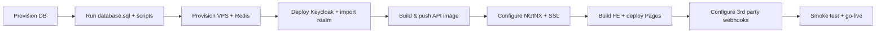

# AIDR — Solution: Kế hoạch deploy Production

**Phạm vi:** hướng dẫn triển khai website AIDR lên môi trường production — kiến trúc, cấu hình từng thành phần, ước tính chi phí, checklist go-live.  
**Tham chiếu:** `architecture-aidr-be.md`, `architecture-aidr-fe.md`, `docker-compose.yml`, `docs/handover-run-src.md`, `docs/guide-payos-settlement-testing.md`.

> **Lưu ý:** Giá dịch vụ cloud thay đổi theo thời điểm và khu vực. Các con số dưới đây là **ước tính tham khảo** (Q3–Q4 2025, quy đổi ~25.000 VND/USD). Luôn kiểm tra bảng giá chính thức trước khi mua.

---

## 1. Tổng quan kiến trúc Production

### 1.1 Sơ đồ đề xuất (MVP → scale vừa)

```
                         ┌─────────────────────────────────────────┐
                         │  Cloudflare (DNS + CDN + WAF + SSL)     │
                         └──────────────────┬──────────────────────┘
                                            │ HTTPS
              ┌─────────────────────────────┼─────────────────────────────┐
              │                             │                             │
              ▼                             ▼                             ▼
     www.aidr.example.com          api.aidr.example.com          auth.aidr.example.com
     (Static FE — Pages/S3)        (NGINX → .NET API)            (Keycloak OIDC)
              │                             │                             │
              │                    ┌────────┴────────┐                    │
              │                    │  Docker host    │                    │
              │                    │  api + nginx    │                    │
              │                    │  redis          │                    │
              │                    │  keycloak       │                    │
              │                    └────────┬────────┘                    │
              │                             │                             │
              └──────── upload ảnh ─────────┼─────────────────────────────┘
                                            │
              ┌─────────────────────────────┼─────────────────────────────┐
              ▼                             ▼                             ▼
     SQL Server (managed)            Redis (managed hoặc          Dịch vụ bên thứ 3
     Aiven / Azure SQL               container cùng host)         payOS · GHN · Groq
                                                                    FPT.AI · SMTP · Google
```

### 1.2 Domain & subdomain gợi ý

| Subdomain | Dịch vụ | Ghi chú |
|-----------|---------|---------|
| `www` hoặc apex | Frontend SPA (`aidr-fe`) | Cloudflare Pages / object storage + CDN |
| `api` | NGINX + .NET API + SignalR `/hubs` | Bắt buộc WebSocket cho chat/notification |
| `auth` | Keycloak | Hoặc path `/auth/` qua cùng NGINX (như `infra/nginx/nginx.conf` dev) |

**Khuyến nghị production:** tách `auth.` riêng subdomain để cấu hình Google OAuth / Keycloak redirect URI rõ ràng.

### 1.3 Hai mô hình triển khai

| Mô hình | Phù hợp | Ưu | Nhược |
|---------|---------|-----|-------|
| **A — Tách lớp (khuyến nghị)** | Go-live thật, traffic ổn định | FE CDN rẻ, DB managed, scale từng phần | Nhiều dịch vụ cần cấu hình |
| **B — All-in-one VPS** | Demo / staging / ngân sách thấp | 1 máy chạy hết compose | Single point of failure; SQL container không phù hợp prod |

Phần còn lại của tài liệu mô tả **Mô hình A** làm chuẩn; Mô hình B ghi chú ở §12.

---

## 2. Checklist trước khi deploy

- [ ] Domain đã mua, DNS trỏ về Cloudflare (hoặc registrar).
- [ ] Chạy `database.sql` + các migration script trong `scripts/` (settlement, shipping, seller-kyc…) trên DB production.
- [ ] **Không** dùng secret dev trong `appsettings.json` — inject qua env / secret manager.
- [ ] Tắt hoặc chặn mọi endpoint `POST /api/dev/*` (chỉ `IsDevelopment()`).
- [ ] payOS: đăng ký **Chi hộ (Payouts)** nếu cần escrow settlement (xem `guide-payos-settlement-testing.md`).
- [ ] Webhook public HTTPS: payOS, GHN (nếu bật auto-fulfillment).
- [ ] SSL/TLS trên mọi endpoint public.
- [ ] Backup DB tự động + kế hoạch restore đã test.
- [ ] Smoke test: `/api/health/live`, `/api/health/ready`, login, checkout, webhook payOS.

---

## 3. Chi tiết từng thành phần

### 3.1 Frontend — `aidr-fe` (React + Vite)

#### Vai trò

SPA storefront + admin/seller; upload ảnh trực tiếp lên Cloudinary; gọi API và SignalR qua HTTPS.

#### Build & host

```bash
cd aidr-fe
cp .env.example .env.production
# Điền biến VITE_* (xem bảng dưới)
npm ci
npm run build
# Output: dist/ — deploy lên static host
```

#### Biến môi trường (`aidr-fe/.env.production`)

| Biến | Production ví dụ | Mô tả |
|------|------------------|-------|
| `VITE_API_BASE_URL` | `https://api.aidr.example.com/api` | Base URL REST (hoặc `/api` nếu cùng origin qua reverse proxy) |
| `VITE_SIGNALR_HUB_URL` | `https://api.aidr.example.com/hubs` | Hub SignalR (WebSocket) |
| `VITE_KEYCLOAK_URL` | `https://auth.aidr.example.com` | Keycloak base URL |
| `VITE_KEYCLOAK_REALM` | `aidr` | Realm |
| `VITE_KEYCLOAK_CLIENT_ID` | `aidr-fe` | Public client |
| `VITE_AUTH_GOOGLE_REDIRECT_URI` | `https://www.aidr.example.com/auth/callback` | Redirect sau Google login |
| `VITE_CLOUDINARY_CLOUD_NAME` | `your_cloud` | Cloudinary cloud name |
| `VITE_CLOUDINARY_UPLOAD_PRESET` | `aidr_unsigned` | Unsigned upload preset |

> Biến `VITE_*` được **nhúng vào bundle lúc build** — cần build lại khi đổi domain.

#### Lựa chọn hosting & chi phí

| Nền tảng | Cấu hình gợi ý | Chi phí ước tính/tháng |
|----------|----------------|------------------------|
| **Cloudflare Pages** | Connect Git, build `npm run build`, output `dist` | **$0** (Free) — bandwidth rộng |
| **Vercel / Netlify** | Tương tự Pages | **$0–20** |
| **S3 + CloudFront** | Bucket private + OAI | **$1–10** (traffic thấp) |
| **Cùng VPS với NGINX** | Serve `dist/` static | $0 thêm (đã tính trong VPS) |

**Khuyến nghị:** Cloudflare Pages (miễn phí, CDN toàn cầu, preview branch cho staging).

#### Cấu hình bổ sung

- **SPA fallback:** mọi route không phải file tĩnh → `index.html` (Pages/Vercel tự xử lý).
- **Security headers:** `X-Frame-Options`, `X-Content-Type-Options`, CSP (tùy mức độ).
- **Không** expose API key Groq/payOS trên FE — chỉ Cloudinary unsigned preset (public by design).

---

### 3.2 Backend API — `aidr-be` (.NET 9)

#### Vai trò

REST API, SignalR hubs (chat, notification), background jobs (settlement, shipping), tích hợp payOS/GHN/Groq/FPT.AI/SMTP.

#### Docker image

Đã có `aidr-be/AIDR.Api/Dockerfile` — publish port `8080` trong container.

```bash
cd aidr-be
docker build -f AIDR.Api/Dockerfile -t aidr-api:latest .
```

#### Biến môi trường chính (override `appsettings.json`)

ASP.NET Core dùng `__` (double underscore) cho nested config:

```bash
# Core
ASPNETCORE_ENVIRONMENT=Production
ConnectionStrings__AidrDb=Server=...;Database=AIDR;User Id=...;Password=...;Encrypt=True;TrustServerCertificate=False;
ConnectionStrings__Redis=redis-host:6379,password=...
Caching__UseInMemory=false

# JWT (nếu dùng login email/password nội bộ song song Keycloak)
Jwt__SigningKey=<random-64-chars-min>
Jwt__Issuer=aidr-api
Jwt__Audience=aidr-fe

# Keycloak
Keycloak__Authority=https://auth.aidr.example.com/realms/aidr
Keycloak__Audience=aidr-api
Keycloak__RequireHttpsMetadata=true
Keycloak__BaseUrl=https://auth.aidr.example.com
Keycloak__Realm=aidr
Keycloak__FrontendClientId=aidr-fe
Keycloak__GoogleIdpAlias=google

# Auth URLs
Auth__FrontendResetPasswordUrl=https://www.aidr.example.com/reset-password

# CORS — chỉ origin production
Cors__Origins__0=https://www.aidr.example.com
Cors__Origins__1=https://aidr.example.com

# SMTP
Smtp__Enabled=true
Smtp__Host=smtp.sendgrid.net
Smtp__Port=587
Smtp__EnableSsl=true
Smtp__Username=apikey
Smtp__Password=<sendgrid-api-key>
Smtp__From=noreply@aidr.example.com
Smtp__FromDisplayName=AIDR

# payOS (production credentials — KHÔNG dùng sandbox)
PayOS__ClientId=...
PayOS__ApiKey=...
PayOS__ChecksumKey=...
PayOS__UseMock=false
PayOS__ReturnUrl=https://www.aidr.example.com/order-received
PayOS__CancelUrl=https://www.aidr.example.com/order-received?cancelled=1

# Settlement
Settlement__CommissionRate=0.03
Settlement__HoldDays=30
Settlement__AutoCompleteDays=7
Settlement__PayoutMode=PayOs
Settlement__EnableBackgroundJob=true

# GHN (production gateway)
Shipping__Provider=GHN
Shipping__EnableAutoFulfillment=true
Shipping__Ghn__BaseUrl=https://online-gateway.ghn.vn
Shipping__Ghn__Token=...
Shipping__Ghn__ShopId=...
Shipping__Ghn__WebhookToken=<random-secret>

# Groq AI
Groq__ApiKey=...
Groq__Model=llama-3.3-70b-versatile
Groq__UseMock=false

# FPT.AI eKYC
FptAi__ApiKey=...
FptAi__UseMock=false
FptAi__AllowedImageHosts__0=res.cloudinary.com
```

#### Hosting & chi phí

| Option | Spec gợi ý | Chi phí/tháng |
|--------|------------|---------------|
| **VPS** (Vultr, DO, Lightsail) | 2 vCPU, 4 GB RAM | **$12–24** (~300k–600k VND) |
| **VPS scale** | 4 vCPU, 8 GB RAM | **$24–48** |
| **Azure App Service** | B1/B2 Linux container | **$13–55** |
| **AWS ECS Fargate** | 0.5 vCPU, 1 GB | **$15–40** + ALB |

**Khuyến nghị MVP:** 1 VPS 4 GB chạy `api` + `nginx` + `redis` (container); Keycloak có thể cùng máy hoặc tách 2 GB riêng.

#### Health check

| Endpoint | Mục đích |
|----------|----------|
| `GET /api/health/live` | Liveness — process sống |
| `GET /api/health/ready` | Readiness — SQL + Redis |

Cấu hình load balancer / orchestrator probe vào 2 endpoint này.

---

### 3.3 NGINX — Reverse proxy

#### Vai trò

Terminate HTTPS (hoặc Cloudflare origin), proxy `/api/` và `/hubs/` (WebSocket) tới API, proxy `/auth/` tới Keycloak.

Tham khảo cấu hình dev: `infra/nginx/nginx.conf`.

#### Production `nginx.conf` (điểm khác so với dev)

```nginx
# Bổ sung so với dev:
# - listen 443 ssl http2
# - ssl_certificate / ssl_certificate_key (hoặc Cloudflare Origin Cert)
# - client_max_body_size 20m (upload qua API nếu có)
# - proxy_read_timeout 3600s cho SignalR WebSocket
# - real_ip từ Cloudflare (set_real_ip_from + CF-Connecting-IP)

location /hubs/ {
    proxy_pass http://aidr_api;
    proxy_http_version 1.1;
    proxy_set_header Upgrade $http_upgrade;
    proxy_set_header Connection "upgrade";
    proxy_set_header Host $host;
    proxy_read_timeout 3600s;
    proxy_send_timeout 3600s;
}
```

#### Chi phí

Chạy trên cùng VPS với API → **$0 thêm**.  
Managed load balancer (AWS ALB, Azure LB): **$15–25/tháng** nếu cần HA multi-AZ.

---

### 3.4 SQL Server — Database

#### Vai trò

Source of truth — toàn bộ schema trong `database.sql` + scripts `scripts/*.sql`.

#### Lựa chọn & chi phí

| Provider | Tier gợi ý | Chi phí/tháng | Ghi chú |
|----------|------------|---------------|---------|
| **Azure SQL Database** | Basic / S0 (10 DTU) | **$5–15** | Gần VN (Southeast Asia), backup tự động |
| **Azure SQL** | S1 (20 DTU) | **~$30** | Traffic vừa |
| **Aiven for SQL Server** | Startup | **~$50–120** | Đúng như architecture doc |
| **AWS RDS SQL Server** | db.t3.small | **~$50–80** | License SQL Server đắt hơn PostgreSQL |
| **SQL trên VPS** (compose) | 2 GB RAM dedicated | $0 thêm | **Không khuyến nghị prod** — tự backup, không HA |

**Khuyến nghị MVP:** Azure SQL Basic/S0 + automated backup 7–35 ngày.

#### Cấu hình

1. Tạo database `AIDR`.
2. Chạy `database.sql`.
3. Chạy lần lượt (nếu chưa có trong schema gốc):
   - `scripts/settlement-schema.sql`
   - `scripts/seller-kyc-schema.sql`
   - `scripts/shipping-schema.sql`
4. Connection string production: `Encrypt=True`, user riêng (không `sa`), firewall chỉ IP app server.
5. **Không** seed demo trên production (`/api/dev/seed-*`).

#### Backup

| Hạng mục | Chi phí |
|----------|---------|
| Azure automated backup (included) | Trong giá SQL tier |
| Point-in-time restore | Included (Basic: 7 ngày) |
| Export manual → storage | **~$0.02/GB/tháng** |

---

### 3.5 Redis — Cache & SignalR backplane (tùy chọn)

#### Vai trò

Cache catalog, session phụ, rate limit. Nếu scale **nhiều instance API**, cần Redis làm SignalR backplane.

#### Lựa chọn & chi phí

| Option | Chi phí/tháng |
|--------|---------------|
| Container trên cùng VPS | **$0** |
| **Upstash Redis** (serverless) | **$0–10** (free tier có giới hạn) |
| **Redis Cloud** 250 MB | **$0–7** |
| **Azure Cache for Redis** Basic C0 | **~$16** |

**MVP 1 instance API:** Redis container trên VPS đủ dùng.  
**Scale horizontal:** Upstash hoặc Azure Cache.

```bash
ConnectionStrings__Redis=your-redis:6379,password=...,ssl=True,abortConnect=False
Caching__UseInMemory=false
```

---

### 3.6 Keycloak — Identity (IAM)

#### Vai trò

OAuth2/OIDC, login email, Google federated IdP, roles BUYER/SELLER/ADMIN.

Realm import: `infra/keycloak/aidr-realm.json` — **phải cập nhật** trước production:

| Mục | Production |
|-----|------------|
| `redirectUris` client `aidr-fe` | `https://www.aidr.example.com/*` |
| `webOrigins` | `https://www.aidr.example.com` |
| Google IdP | Bật + Client ID/Secret thật |
| `sslRequired` | `external` hoặc `all` |
| Admin console | Đổi `KEYCLOAK_ADMIN_PASSWORD` mạnh |

#### Chạy production (không dùng `start-dev`)

```yaml
command: ["start", "--import-realm", "--optimized"]
environment:
  KC_DB: postgres  # hoặc mssql — Keycloak 26 khuyến nghị Postgres riêng
  KC_HOSTNAME: auth.aidr.example.com
  KC_PROXY: edge          # đứng sau Cloudflare/NGINX
  KC_HTTP_ENABLED: "true"
```

#### Hosting & chi phí

| Option | Chi phí/tháng |
|--------|---------------|
| Container trên VPS API (thêm ~512 MB–1 GB RAM) | **$0** thêm |
| VPS riêng 2 GB cho Keycloak + Postgres | **$6–12** |
| **Keycloak managed** (Phase Two, etc.) | **$25–100+** |

**Khuyến nghị MVP:** Keycloak container + Postgres container trên cùng VPS 4–8 GB.

#### Google OAuth

1. [Google Cloud Console](https://console.cloud.google.com/) → OAuth 2.0 Client.
2. Authorized redirect URI:  
   `https://auth.aidr.example.com/realms/aidr/broker/google/endpoint`
3. Cập nhật IdP trong Keycloak Admin hoặc realm JSON.

**Chi phí Google OAuth:** **$0**.

---

### 3.7 Cloudinary — Media upload

#### Vai trò

Upload ảnh sản phẩm, avatar, eKYC (FE unsigned upload).

#### Cấu hình

1. Tạo Cloudinary account → lấy `cloud_name`.
2. Settings → Upload → Add upload preset:
   - Signing mode: **Unsigned** (hoặc signed nếu muốn bảo mật hơn — cần sửa FE).
   - Folder: `aidr/products`, `aidr/avatars`…
   - Allowed formats: `jpg,png,webp`.
   - Max file size: 5–10 MB.
3. BE `FptAi:AllowedImageHosts` phải chứa `res.cloudinary.com`.

#### Chi phí

| Plan | Chi phí | Ghi chú |
|------|---------|---------|
| **Free** | **$0** | ~25 credits/tháng, đủ dev/MVP nhỏ |
| **Plus** | **~$99/tháng** | Production có traffic upload nhiều |
| Storage/bandwidth vượt quota | Pay-as-you-go | Xem dashboard |

---

### 3.8 payOS — Thanh toán & Chi hộ

#### Vai trò

Thu tiền buyer (payment link / VietQR), webhook xác nhận đơn, chi hộ seller/refund (Payouts API).

Chi tiết: `docs/guide-payos-settlement-testing.md`, `docs/solution-escrow-settlement.md`.

#### Cấu hình production

| Bước | Hành động |
|------|-----------|
| 1 | Đăng ký merchant **production** tại [payOS](https://payos.vn) |
| 2 | Lấy `ClientId`, `ApiKey`, `ChecksumKey` production |
| 3 | Đăng ký **Chi hộ (Payouts)** riêng — không tự có khi tạo kênh thanh toán |
| 4 | Nạp số dư tài khoản chi hộ để payout seller/refund |
| 5 | Webhook URL: `https://api.aidr.example.com/api/payments/payos/webhook` |
| 6 | Admin gọi `POST /api/payments/payos/confirm-webhook` sau deploy |
| 7 | `PayOS__ReturnUrl` / `CancelUrl` trỏ domain FE production |

#### Chi phí

| Hạng mục | Ước tính |
|----------|----------|
| Phí kích hoạt / duy trì tài khoản | Theo hợp đồng payOS (thường **miễn phí** hoặc phí thấp cho SME) |
| Phí giao dịch thu hộ | **~1.5–2%**/giao dịch (thương lượng theo volume) |
| Phí chi hộ (payout) | Theo bảng giá payOS (fixed + % tùy gói) |
| Không có phí cloud cố định | Chỉ trả theo giao dịch |

> Sandbox: **$0** — dùng cho staging.

---

### 3.9 GHN — Vận chuyển tự động

#### Vai trò

Tạo vận đơn sau thanh toán, webhook/poll cập nhật trạng thái đơn.

Chi tiết: `docs/solution-auto-fulfillment-shipping.md`.

#### Cấu hình production

```bash
Shipping__Ghn__BaseUrl=https://online-gateway.ghn.vn   # KHÔNG dùng dev-online-gateway
Shipping__Ghn__Token=<token từ GHN dashboard>
Shipping__Ghn__ShopId=<shop id production>
Shipping__Ghn__WebhookToken=<secret tự đặt>
```

Webhook GHN (nếu hỗ trợ): `https://api.aidr.example.com/api/shipping/ghn/webhook`

#### Chi phí

| Hạng mục | Ước tính |
|----------|----------|
| API access | **$0** (theo hợp đồng shop GHN) |
| Cước vận chuyển | Trả theo đơn — **không phải chi phí infra** |
| COD / bảo hiểm | Tùy gói GHN |

---

### 3.10 Groq — AI Shopping Assistant

#### Vai trò

LLM cho tư vấn mua hàng, so sánh sản phẩm (`Groq` section trong `appsettings.json`).

#### Cấu hình

```bash
Groq__ApiKey=gsk_...        # https://console.groq.com/keys
Groq__Model=llama-3.3-70b-versatile
Groq__UseMock=false
Groq__TimeoutSeconds=60
```

#### Chi phí

| Tier | Chi phí |
|------|---------|
| Free tier | **$0** — rate limit (RPM/TPM) |
| Pay-as-you-go | **~$0.05–0.79 / 1M tokens** tùy model |
| MVP ước tính | **$5–30/tháng** nếu vài nghìn phiên chat |

**Staging:** `Groq__UseMock=true` hoặc key riêng để tránh tốn quota prod.

---

### 3.11 FPT.AI — eKYC seller onboarding

#### Vai trò

OCR CCCD + face match khi đăng ký bán hàng.

Chi tiết: `docs/solution-seller-onboarding-ekyc.md`.

#### Cấu hình

```bash
FptAi__BaseUrl=https://api.fpt.ai
FptAi__ApiKey=<key từ FPT.AI dashboard>
FptAi__UseMock=false
FptAi__FaceMatchThreshold=0.80
FptAi__AllowedImageHosts__0=res.cloudinary.com
```

#### Chi phí

| Hạng mục | Ước tính |
|----------|----------|
| Gói API FPT.AI | **Theo request** — liên hệ sales hoặc dashboard |
| OCR + Face match / lượt KYC | **~2.000–10.000 VND/lượt** (tham khảo, tùy gói) |
| MVP (50 seller/tháng) | **~100k–500k VND/tháng** |

**Staging:** `FptAi__UseMock=true` — không tốn phí API.

---

### 3.12 SMTP — Email transactional

#### Vai trò

Reset password, thông báo email (nếu bật).

#### Lựa chọn & chi phí

| Provider | Free tier | Paid |
|----------|-----------|------|
| **SendGrid** | 100 email/ngày | **$19.95/tháng** (50k emails) |
| **Amazon SES** | 62k/tháng (từ EC2) | **$0.10/1k emails** |
| **Brevo (Sendinblue)** | 300 email/ngày | **~$9/tháng** |
| **Gmail SMTP** | ~500/ngày | **$0** — không khuyến nghị prod |

Cấu hình xem `aidr-be/AIDR.Api/.env.example`.

---

### 3.13 DNS, SSL, CDN — Cloudflare

#### Cấu hình DNS (ví dụ)

| Type | Name | Target |
|------|------|--------|
| CNAME | `www` | `aidr-fe.pages.dev` (hoặc VPS) |
| A / CNAME | `api` | IP VPS hoặc LB |
| A / CNAME | `auth` | IP VPS Keycloak |
| TXT | `@` | SPF (nếu gửi mail từ domain) |

#### SSL

- **Cloudflare Universal SSL:** **$0** (Full Strict + Origin Certificate cho VPS).
- Hoặc **Let's Encrypt** trên NGINX (certbot): **$0**.

#### Chi phí Cloudflare

| Plan | Chi phí/tháng |
|------|---------------|
| Free | **$0** — CDN, DNS, SSL, basic DDoS |
| Pro | **$20** — WAF rules, image polish |
| Business | **$200** — SLA cao hơn |

**Khuyến nghị MVP:** Cloudflare Free.

---

### 3.14 Domain

| Loại | Chi phí/năm |
|------|-------------|
| `.com` | **~$10–15** (~250k–375k VND) |
| `.vn` | **~300k–800k VND** (qua registrar VN) |

---

### 3.15 Monitoring & Logging (khuyến nghị)

Architecture doc đề cập Grafana + Serilog.

| Thành phần | Option | Chi phí/tháng |
|------------|--------|---------------|
| **Uptime probe** | UptimeRobot, Better Stack free | **$0** |
| **Logs** | Grafana Cloud free tier | **$0** (50 GB ingest) |
| **APM** | Application Insights (Azure) | **~$0–25** (free tier 5 GB) |
| **Self-host Prometheus + Grafana** | Trên VPS | **$0** thêm |

Health endpoints để alert:

- `https://api.aidr.example.com/api/health/ready` → fail nếu DB/Redis down.

---

## 4. Bảng tổng hợp chi phí theo giai đoạn

### 4.1 Staging (pre-production)

| Hạng mục | Chi phí/tháng |
|----------|---------------|
| Cloudflare Pages (FE staging branch) | $0 |
| VPS 2 GB (API + Redis + Keycloak dev mode) | $6–12 |
| Azure SQL Basic (hoặc SQL container) | $0–5 |
| Cloudflare Free | $0 |
| payOS sandbox, GHN dev, Groq free, FptAi mock | $0 |
| **Tổng staging** | **~$6–20/tháng** (~150k–500k VND) |

### 4.2 Production MVP (traffic thấp, < 1k DAU)

| Hạng mục | Chi phí/tháng |
|----------|---------------|
| Domain `.com` (chia 12) | ~$1 |
| Cloudflare Free + Pages | $0 |
| VPS 4 GB (API, NGINX, Redis, Keycloak) | $12–24 |
| Azure SQL S0 | $15–30 |
| SendGrid / SES | $0–10 |
| Cloudinary Free | $0 |
| Groq (usage thấp) | $0–10 |
| FPT.AI eKYC (theo lượt) | ~$5–20 |
| payOS | $0 cố định + % giao dịch |
| GHN | $0 API + cước ship |
| Monitoring free tier | $0 |
| **Tổng infra cố định** | **~$35–95/tháng** (~900k–2.4 triệu VND) |

### 4.3 Production vừa (scale, HA cơ bản)

| Hạng mục | Chi phí/tháng |
|----------|---------------|
| 2× VPS hoặc managed container | $50–100 |
| Azure SQL S1 + backup | $30–50 |
| Redis managed | $10–20 |
| Cloudflare Pro | $20 |
| Cloudinary Plus | $99 |
| SendGrid / SES | $20–50 |
| Groq + FPT.AI usage | $50–200 |
| **Tổng** | **~$280–540/tháng** (~7–13.5 triệu VND) |

> **Biến phí lớn nhất khi vận hành thật:** phí giao dịch payOS, cước GHN, AI API — tỷ lệ thuận với GMV và lượt dùng, không phải chi phí server.

---

## 5. Quy trình deploy (runbook)

### 5.1 Chuẩn bị môi trường



### 5.2 Thứ tự triển khai

1. **Database:** tạo instance → chạy schema → tạo user app (least privilege).
2. **Keycloak:** deploy → import realm production → cấu hình Google IdP → test login.
3. **API:** deploy container với env production → verify `/api/health/ready`.
4. **NGINX:** SSL + proxy `/api`, `/hubs`, `/auth` → test WebSocket (chat).
5. **Frontend:** build với `.env.production` → deploy → test CORS + login flow.
6. **Webhooks:**
   - payOS: `confirm-webhook` + test 1 đơn nhỏ.
   - GHN: test tạo vận đơn staging trước khi bật prod gateway.
7. **Tắt dev endpoints:** xác nhận `ASPNETCORE_ENVIRONMENT=Production`.
8. **Monitoring:** uptime check + log aggregation.

### 5.3 CI/CD gợi ý (GitHub Actions)

```yaml
# Pseudocode pipeline
on:
  push:
    branches: [main]

jobs:
  build-api:
    - docker build → push GHCR/ACR
    - ssh deploy VPS: docker compose pull && up -d api

  build-fe:
    - npm ci && npm run build
    - deploy to Cloudflare Pages (wrangler/pages-action)
```

**Chi phí CI:** GitHub Actions free tier **2.000 phút/tháng** — đủ cho repo nhỏ (**$0**).

### 5.4 Rollback

| Thành phần | Cách rollback |
|------------|---------------|
| API | Deploy lại image tag trước (`docker compose up` với tag cũ) |
| FE | Cloudflare Pages → rollback deployment trước |
| DB | Point-in-time restore (Azure) — **cẩn thận data loss** |
| Keycloak | Backup realm export trước mỗi thay đổi |

---

## 6. Bảo mật production

| Mục | Hành động |
|-----|-----------|
| Secrets | Env vars / Azure Key Vault / Docker secrets — không commit |
| `appsettings.json` | Xóa/rotate mọi key dev đã lộ trong repo |
| DB | User riêng, firewall IP, TLS |
| Keycloak admin | Password mạnh, không expose port 8080 public (chỉ qua NGINX) |
| CORS | Whitelist đúng domain FE |
| Rate limit | Login, AI endpoints (architecture §8) |
| payOS webhook | Verify checksum; chỉ HTTPS |
| GHN webhook | Verify `WebhookToken` |
| Headers | HSTS, CSP, X-Frame-Options qua Cloudflare/NGINX |

---

## 7. Staging vs Production

| | Staging | Production |
|---|---------|------------|
| Domain | `staging.aidr.example.com` | `www.aidr.example.com` |
| payOS | Sandbox | Production + Payouts |
| GHN | `dev-online-gateway.ghn.vn` | `online-gateway.ghn.vn` |
| Groq / FPT.AI | Mock hoặc key riêng | Key production, quota monitor |
| DB | Instance riêng | Instance riêng — **không share** |
| Seed data | `seed-all` OK | **Không seed** |

---

## 8. Mô hình B — All-in-one VPS (ngân sách tối thiểu)

Chạy gần như `docker-compose.yml` hiện tại trên 1 VPS 8 GB:

```bash
# Chỉnh compose: ASPNETCORE_ENVIRONMENT=Production, connection string external DB
docker compose up -d --build
```

| Thành phần | Ghi chú |
|------------|---------|
| SQL Server container | Chấp nhận được cho demo; prod nên managed DB |
| Keycloak `start-dev` | **Đổi** sang `start` + DB riêng |
| Mailhog | **Bỏ** — dùng SMTP thật |
| FE | Build `dist/` serve qua NGINX cùng máy |

**Chi phí:** **~$24–48/tháng** (VPS 8 GB) + domain + phí giao dịch.

---

## 9. Sau go-live

- [ ] Theo dõi `/api/health/ready` và error rate 5xx.
- [ ] Kiểm tra job nền: settlement, shipping (log container API).
- [ ] Review số dư tài khoản chi hộ payOS trước mỗi đợt payout.
- [ ] Rotate secrets định kỳ (90 ngày).
- [ ] Backup restore drill hàng quý.

---

## 10. Tài liệu liên quan

| File | Nội dung |
|------|----------|
| `docs/handover-run-src.md` | Chạy local dev |
| `docs/architecture-aidr-be.md` | Kiến trúc BE, deployment §9 |
| `docs/architecture-aidr-fe.md` | Env FE, Cloudinary |
| `docs/guide-payos-settlement-testing.md` | payOS webhook + escrow test |
| `docs/solution-escrow-settlement.md` | Settlement & payout |
| `docs/solution-auto-fulfillment-shipping.md` | GHN integration |
| `docs/solution-seller-onboarding-ekyc.md` | FPT.AI eKYC |
| `docker-compose.yml` | Reference stack dev |
| `infra/nginx/nginx.conf` | NGINX routing |
| `infra/keycloak/aidr-realm.json` | Realm template |

---

## 11. Phụ lục — Template `.env.production` FE

```env
VITE_API_BASE_URL=https://api.aidr.example.com/api
VITE_SIGNALR_HUB_URL=https://api.aidr.example.com/hubs
VITE_KEYCLOAK_URL=https://auth.aidr.example.com
VITE_KEYCLOAK_REALM=aidr
VITE_KEYCLOAK_CLIENT_ID=aidr-fe
VITE_AUTH_GOOGLE_REDIRECT_URI=https://www.aidr.example.com/auth/callback
VITE_CLOUDINARY_CLOUD_NAME=your_cloud_name
VITE_CLOUDINARY_UPLOAD_PRESET=your_unsigned_preset
```

## 12. Phụ lục — Checklist webhook URLs

| Dịch vụ | URL production |
|---------|----------------|
| payOS payment webhook | `https://api.<domain>/api/payments/payos/webhook` |
| GHN shipping webhook | `https://api.<domain>/api/shipping/ghn/webhook` |
| Google OAuth redirect | `https://auth.<domain>/realms/aidr/broker/google/endpoint` |
| payOS return | `https://www.<domain>/order-received` |
