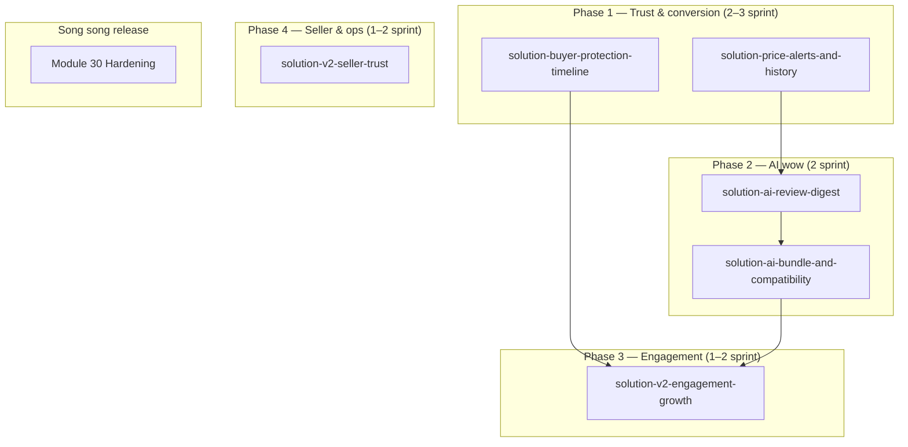

# AIDR — Solution Roadmap v2 (Post-MVP)

**Status:** Implemented  
**Tiền đề:** Modules 01–29 `Done` trong `plan-implement-module.md`; module 30 (Hardening) vẫn `Todo`  
**Mục tiêu:** Gom các tính năng v2 đề xuất thành lộ trình implement có dependency rõ, mỗi nhóm có solution doc riêng trước khi code.

---

## 1. Tổng quan

AIDR MVP đã có buy-path end-to-end, AI assistant, escrow, eKYC, GHN auto-fulfillment. v2 tập trung vào:

1. **Buyer trust & conversion** — minh bạch giá, bảo vệ buyer, review AI digest  
2. **AI differentiator** — bundle phụ kiện, compatibility check (bám điện tử)  
3. **Engagement & retention** — alert, reorder, follow feed, Q&A  
4. **Seller pro tools & trust** — badge, restock hint, flash sale  
5. **Growth** — referral, abandoned cart (phase sau)

Không thay đổi BR cốt lõi: **không Exchange**, escrow kế toán, seller duyệt SP, FIFO lot cost.

---

## 2. Mapping UC (reserved IDs)

Các ID trống trong `usecase.md` được gán cho v2:

| UC | Tên | Priority | Solution doc |
|----|-----|----------|--------------|
| UC-51 | Manage Product Price Alerts | P1 | `solution-price-alerts-and-history.md` |
| UC-55 | View Product Price History (Buyer) | P1 | `solution-price-alerts-and-history.md` |
| UC-82 | View AI Review Digest | P2 | `solution-ai-review-digest.md` |
| UC-83 | View Smart Accessory Bundle | P2 | `solution-ai-bundle-and-compatibility.md` |
| UC-84 | Check Product Compatibility | P2 | `solution-ai-bundle-and-compatibility.md` |
| UC-86 | View Buyer Protection Timeline | P1 | `solution-buyer-protection-timeline.md` |
| UC-68 | One-Click Reorder | P2 | `solution-v2-engagement-growth.md` |
| *(new)* | Product Q&A (public) | P2 | `solution-v2-engagement-growth.md` |
| *(new)* | Seller Trust Badges | P2 | `solution-v2-seller-trust.md` |
| *(new)* | AI Restock Advisor (seller) | P3 | `solution-v2-seller-trust.md` |

> Các UC mới chưa có số — khi implement sẽ bổ sung vào `usecase.md` và cập nhật bảng trên.

---

## 3. Phases & dependency

| Phase | Deliverable demo | Module BE chính | FE area |
|-------|------------------|-----------------|---------|
| **1** | PDP có chart giá + bật alert; order detail có protection timeline | Engagement, Discovery, Order | `catalog/`, `account/` |
| **2** | PDP review digest; bundle widget + compatibility modal | AI, Engagement | `catalog/`, AI widget |
| **3** | Reorder, follow feed, Q&A tab | Order, Engagement, Notifications | `account/`, `catalog/` |
| **4** | Seller badge trên shop; restock hint dashboard | SellerCenter, Admin | `seller/`, storefront shop |
| **Release** | Grafana, rate-limit, E2E smoke | Foundation | — |

---

## 4. Index solution docs

| File | Phạm vi |
|------|---------|
| [`solution-price-alerts-and-history.md`](./solution-price-alerts-and-history.md) | UC-51, UC-55 — alert giá/tồn từ wishlist + biểu đồ lịch sử giá buyer |
| [`solution-buyer-protection-timeline.md`](./solution-buyer-protection-timeline.md) | UC-86 — UI minh bạch escrow / return window trên order buyer |
| [`solution-ai-review-digest.md`](./solution-ai-review-digest.md) | UC-82 — tóm tắt review bằng AI trên PDP |
| [`solution-ai-bundle-and-compatibility.md`](./solution-ai-bundle-and-compatibility.md) | UC-83, UC-84 — gợi ý combo phụ kiện + kiểm tra tương thích spec |
| [`solution-v2-engagement-growth.md`](./solution-v2-engagement-growth.md) | UC-68, follow feed, Q&A, referral/abandoned cart (outline) |
| [`solution-v2-seller-trust.md`](./solution-v2-seller-trust.md) | Badge, restock advisor, flash sale, return AI assist (outline) |

---

## 5. Quy tắc implement chung

1. **Solution trước, code sau** — cập nhật doc này + UC status `In Progress` khi bắt đầu phase.  
2. **English UI** — copy buyer/seller theo rule `aidr-english-ui`.  
3. **Không hiện mã UC trên UI.**  
4. **BE seed + `POST /api/dev/seed-*`** cho mỗi feature có data test (rule `aidr-be-seed-after-feature`).  
5. **Reuse trước, schema sau** — ưu tiên bảng/`MetaJson`/job nền sẵn có; migration chỉ khi doc § schema ghi rõ.  
6. **AI fallback** — mọi tính năng AI phải chạy được khi `Groq:UseMock=true` (rule/heuristic).  
7. **Module 30** — nên chạy song song Phase 1–2 nếu chuẩn bị demo production.

---

## 6. Demo story gợi ý (Phase 1 + 2)

> Buyer xem laptop → thấy **price history** + **AI review digest** → bật **price alert** → hỏi AI **“RAM này có lắp máy kia không?”** → add **bundle ốp + sạc** → checkout → order detail hiện **buyer protection timeline** (escrow 30 ngày, return policy).

---

## 7. File liên quan

| File | Vai trò |
|------|---------|
| `usecase.md` | Gán UC-51, 55, 68, 82–84, 86 khi implement |
| `plan-implement-module.md` | Thêm module 31+ hoặc mở rộng module AI/Engagement |
| `bussiness-system.md` | BR escrow, return, không exchange |
| `solution-escrow-settlement.md` | Nguồn sự thật settlement backend |
| `solution-ai-guided-consult.md` | Assistant v2 — hook bundle sau consult |
